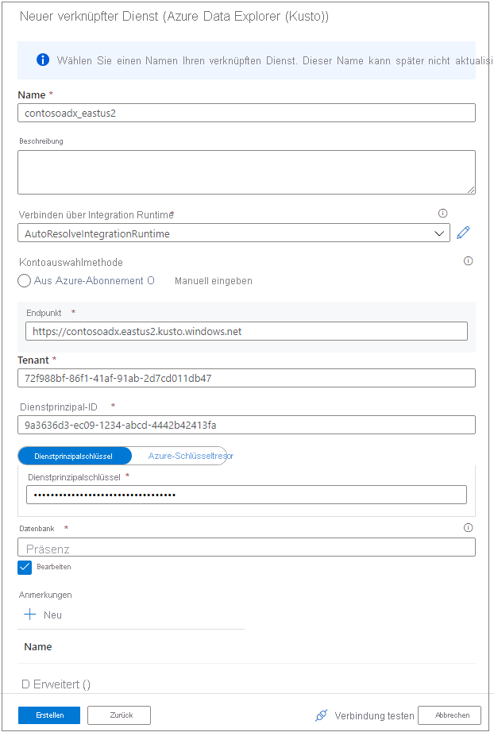
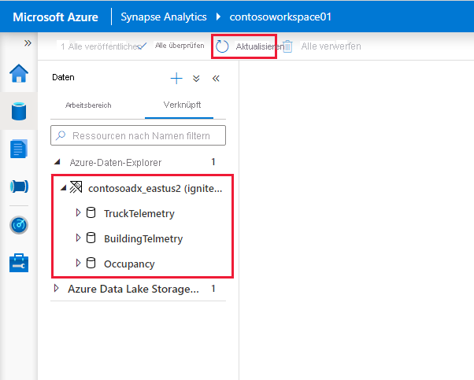

# Verbinden mit Azure Data Explorer per Synapse Apache Spark

In diesem Artikel wird beschrieben, wie Sie aus Synapse Studio mit Synapse Apache Spark auf eine Azure Data Explorer-Datenbank zugreifen. 

## Voraussetzungen

* [Erstellen eines Azure Data Explorer-Clusters und einer Datenbank](/azure/data-explorer/create-cluster-database-portal)
* Einen vorhandenen Synapse-Arbeitsbereich. Erstellen Sie alternativ anhand [dieser Schnellstartanleitung](./quickstart-create-workspace.md) einen neuen Arbeitsbereich. 
* Vorhandener Synapse Apache Spark-Pool oder Erstellung eines neuen Pools gemäß [dieser Schnellstartanleitung](./quickstart-create-apache-spark-pool-portal.md)
* [Erstellen Sie eine Azure AD-App mit Bereitstellung einer Azure AD-Anwendung.](/azure/data-explorer/kusto/management/access-control/how-to-provision-aad-app)
* Gewähren Sie Ihrer Azure AD-App Zugriff auf Ihre Datenbank, indem Sie die Informationen unter [Verwalten der Berechtigungen für Datenbanken in Azure Data Explorer](/azure/data-explorer/manage-database-permissions) verwenden.

## Navigieren zu Synapse Studio

Wählen Sie in einem Synapse-Arbeitsbereich die Option **Synapse Studio starten** aus. Wählen Sie auf der Synapse Studio-Startseite die Option **Daten** aus, um zum **Datenobjekt-Explorer** zu gelangen.

## Herstellen einer Verbindung zwischen einer Azure Data Explorer-Datenbank und einem Synapse-Arbeitsbereich

Für die Verbindungsherstellung einer Azure Data Explorer-Datenbank mit einem Arbeitsbereich wird ein verknüpfter Dienst verwendet. Mit einem verknüpften Azure Data Explorer-Dienst können Benutzer Daten durchsuchen und erkunden, über Apache Spark für Azure Synapse Analytics Lese- und Schreibvorgänge durchführen und Integrationsaufträge in einer Pipeline ausführen.

Führen Sie im Datenobjekt-Explorer die folgenden Schritte aus, um eine direkte Verbindung mit einem Azure Data Explorer-Cluster herzustellen:

1. Wählen Sie neben „Daten“ das Symbol **+** aus.
2. Wählen Sie **Connect to external data** (Verbindung mit externen Daten herstellen) aus.
3. Wählen Sie **Azure Data Explorer (Kusto)** aus.
5. Wählen Sie **Weiter**.
6. Geben Sie einen Namen für den verknüpften Dienst ein. Der Name wird im Objekt-Explorer angezeigt und von Synapse-Laufzeiten verwendet, um eine Verbindung mit der Datenbank herzustellen. Wir empfehlen Ihnen, einen Anzeigenamen zu verwenden.
7. Wählen Sie den Azure Data Explorer-Cluster aus Ihrem Abonnement aus, oder geben Sie den URI ein.
8. Geben Sie die „Dienstprinzipal-ID“ und den „Dienstprinzipalschlüssel“ ein. (Stellen Sie sicher, dass dieser Dienstprinzipal über Anzeigezugriff auf die Datenbank für Lesevorgänge und über Erfassungszugriff für die Erfassung von Daten verfügt.)
9. Eingeben des Azure Data Explorer-Datenbanknamens
10. Klicken Sie auf **Verbindung testen**, um sicherzustellen, dass Sie über die richtigen Berechtigungen verfügen.
11. Klicken Sie auf **Erstellen**

    

    > [!NOTE]
    > (Optional) Beim Testen der Verbindung wird der Schreibzugriff nicht überprüft. Stellen Sie sicher, dass die Dienstprinzipal-ID über Schreibzugriff auf die Azure Data Explorer-Datenbank verfügt.

12. Azure Data Explorer-Cluster und -Datenbanken werden auf der Registerkarte **Verknüpft** im Azure Data Explorer-Abschnitt angezeigt. 

    

    > [!NOTE] 
    > Im aktuellen Release werden die Datenbankobjekte basierend auf Ihren AAD-Kontoberechtigungen in den Azure Data Explorer-Datenbanken aufgefüllt. Beim Ausführen der Apache Spark-Notebooks oder -Integrationsaufträge werden die Anmeldeinformationen im Linkdienst (Dienstprinzipal) verwendet.

## Schnelles Interagieren mit durch Code generierte Aktionen

* Wenn Sie mit der rechten Maustaste auf eine Datenbank oder Tabelle klicken, wird eine Liste mit Gesten angezeigt, mit denen ein Spark-Beispielnotebook zum Lesen, Schreiben und Streamen von Daten in Azure Data Explorer ausgelöst wird. 
    

* Hier ist ein Beispiel für das Lesen von Daten angegeben. Fügen Sie das Notebook an Ihren Spark-Pool an, und führen Sie die Zelle  aus.

   > [!NOTE] 
   > Bei der erstmaligen Ausführung kann es mehr als drei Minuten dauern, bis die Spark-Sitzung initiiert wurde. Nachfolgende Ausführungen sind dann deutlich schneller.  

## Einschränkungen
Der Azure Data Explorer-Connector wird für ein verwaltetes Azure Synapse-VNET derzeit nicht unterstützt.

## Nächste Schritte

* [Beispielcode mit erweiterten Optionen](https://github.com/Azure/azure-kusto-spark/blob/master/samples/src/main/python/SynapseSample.py)
* [Azure Data Explorer (Kusto): Spark-Connector](https://github.com/Azure/azure-kusto-spark)