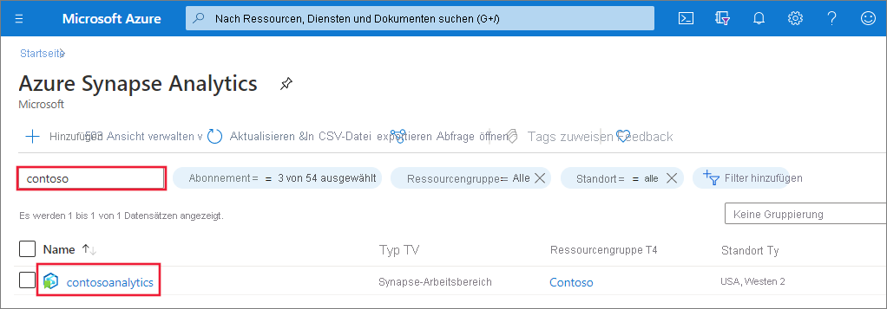
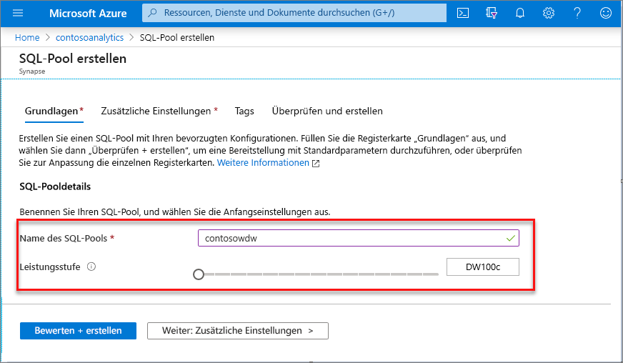
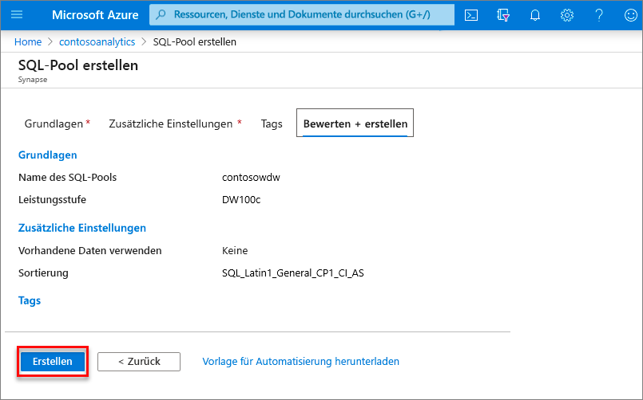
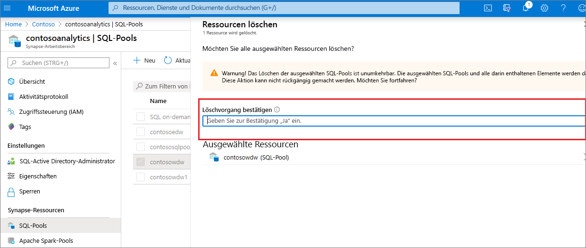

# Schnellstart: Erstellen eines Synapse SQL-Pools (Vorschau) über das Azure-Portal

Azure Synapse Analytics enthält verschiedene Analysemodule, mit denen Sie Ihre Daten erfassen, transformieren, modellieren und analysieren können. Ein SQL-Pool bietet T-SQL-basierte Compute- und Speicherfunktionen. Nach der Erstellung eines SQL-Pools in Ihrem Synapse-Arbeitsbereich können Daten geladen, modelliert, verarbeitet und für einen schnelleren analytischen Einblick bereitgestellt werden.

In diesem Schnellstart erfahren Sie, wie Sie über das Azure-Portal einen SQL-Pool in einem Synapse-Arbeitsbereich erstellen.

Wenn Sie kein Azure-Abonnement besitzen, können Sie ein [kostenloses Konto](https://azure.microsoft.com/free/) erstellen, bevor Sie beginnen.

## Voraussetzungen

- Azure-Abonnement – [Erstellen eines kostenlosen Kontos](https://azure.microsoft.com/free/)
- [Synapse-Arbeitsbereich](./quickstart-create-workspace.md)

## Melden Sie sich auf dem Azure-Portal an.

Melden Sie sich beim [Azure-Portal](https://portal.azure.com/)

## Navigieren zum Synapse-Arbeitsbereich

1. Navigieren Sie zu dem Synapse-Arbeitsbereich, in dem der SQL-Pool erstellt werden soll, indem Sie in die Suchleiste den Dienstnamen (oder direkt den Ressourcennamen) eingeben.
 
1. Geben Sie in der Liste der Arbeitsbereiche den Namen (oder einen Teil des Namens) des zu öffnenden Arbeitsbereichs ein. In diesem Beispiel verwenden wir einen Arbeitsbereich namens **contosoanalytics**.

## Erstellen eines neuen SQL-Pools

1. Wählen Sie in dem Synapse-Arbeitsbereich, in dem Sie den SQL-Pool erstellen möchten, auf der oberen Leiste den Befehl **New SQL pool** (Neuer SQL-Pool) aus.

2. Geben Sie auf der Registerkarte **Grundeinstellungen** die folgenden Informationen ein:

    | Einstellung | Vorgeschlagener Wert | BESCHREIBUNG |
    | :------ | :-------------- | :---------- |
    | **Name des SQL-Pools** | Ein gültiger Name | Name für den SQL-Pool |
    | **Leistungsstufe** | DW100c | Legen Sie die kleinste Größe fest, um die Kosten für diesen Schnellstart zu senken. |

  
    
    > [!IMPORTANT]
    > Beachten Sie, dass für die Namen, die von SQL-Pools verwendet werden können, bestimmte Einschränkungen gelten. Namen dürfen keine Sonderzeichen enthalten, höchstens 15 Zeichen lang sein und keine reservierten Wörter enthalten und müssen im Arbeitsbereich eindeutig sein.

3. Klicken Sie auf **Weiter: Zusätzliche Einstellungen**.
4. Wählen Sie **Keine** aus, um den SQL-Pool ohne Daten bereitzustellen. Übernehmen Sie die ausgewählte Standardsortierung.

5. Klicken Sie auf **Überprüfen + erstellen**.
6. Vergewissern Sie sich anhand der vorherigen Eingaben, dass die Details korrekt sind. Klicken Sie auf **Erstellen**.

7. Der Flow für die Ressourcenbereitstellung wird nun gestartet.
 

8. Wenn Sie nach Abschluss der Bereitstellung zurück zum Arbeitsbereich navigieren, wird ein neuer Eintrag für den neu erstellten SQL-Pool angezeigt.
 

Nach der Erstellung des SQL-Pools ist er im Arbeitsbereich zum Laden von Daten, Verarbeiten von Datenströmen, Lesen aus dem Data Lake usw. verfügbar.

## Bereinigen von Ressourcen

Führen Sie die folgenden Schritte aus, um den SQL-Pool aus dem Arbeitsbereich zu löschen.
> [!WARNING]
> Wenn Sie einen SQL-Pool löschen, werden die Analyse-Engine und die in der Datenbank des gelöschten SQL-Pools gespeicherten Daten aus dem Arbeitsbereich entfernt. Sie können keine Verbindung mehr mit dem SQL-Pool herstellen, und Abfragen, Pipelines und Notebooks, die aus diesem SQL-Pool lesen oder in diesen SQL-Pool schreiben, funktionieren nicht mehr.

Führen Sie die folgenden Schritte aus, wenn Sie den SQL-Pool löschen möchten:

1. Navigieren Sie auf dem Blatt des Arbeitsbereichs zum Blatt mit den SQL-Pools.
1. Wählen Sie den zu löschenden SQL-Pool aus (in diesem Fall **contosowdw**).
1. Klicken Sie nach der Auswahl auf **Löschen**.
1. Bestätigen Sie den Löschvorgang, und klicken Sie auf die Schaltfläche **Löschen** 
1. Wenn der Vorgang erfolgreich abgeschlossen wurde, wird der SQL-Pool nicht mehr in den Arbeitsbereichsressourcen aufgeführt.

## Nächste Schritte

- Weitere Informationen finden Sie unter [Schnellstart: Erstellen eines Apache Spark-Pools (Vorschauversion) in Synapse Analytics mithilfe von Webtools](quickstart-apache-spark-notebook.md).
- Weitere Informationen finden Sie unter [Schnellstart: Erstellen eines neuen Apache Spark-Pools (Vorschauversion)](quickstart-create-apache-spark-pool-portal.md).
