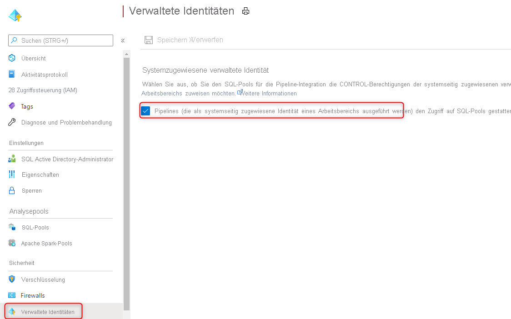

# <a name="securely-load-data-using-synapse-sql"></a>Sicheres Laden von Daten mithilfe von Synapse SQL

In diesem Artikel werden sichere Authentifizierungsmechanismen für die [COPY-Anweisung](/sql/t-sql/statements/copy-into-transact-sql?view=azure-sqldw-latest&preserve-view=true) erläutert und Beispiele dazu bereitgestellt. Die COPY-Anweisung ist die flexibelste und sicherste Methode zum Massenladen von Daten in Synapse SQL.
## <a name="supported-authentication-mechanisms"></a>Unterstützte Authentifizierungsmechanismen

In der nachstehenden Matrix werden die unterstützten Authentifizierungsmethoden für jeden Dateityp und jedes Speicherkonto beschrieben. Dies gilt für den Quellspeicherort und den Speicherort der Fehlerdatei.

|                          |                CSV                |                      Parquet                       |                        ORC                         |
| :----------------------: | :-------------------------------: | :------------------------------------------------: | :------------------------------------------------: |
|  **Azure Blob Storage**  | SAS/MSI/SERVICE PRINCIPAL/KEY/AAD |                      SAS/KEY                       |                      SAS/KEY                       |
| **Azure Data Lake Gen2** | SAS/MSI/SERVICE PRINCIPAL/KEY/AAD | SAS (blob<sup>1</sup>)/MSI (dfs<sup>2</sup>)/SERVICE PRINCIPAL/KEY/AAD | SAS (blob<sup>1</sup>)/MSI (dfs<sup>2</sup>)/SERVICE PRINCIPAL/KEY/AAD |

1: Der .blob-Endpunkt ( **.blob**.core.windows.net) unter Ihrem externen Speicherortpfad ist für diese Authentifizierungsmethode erforderlich.

2: Der .dfs-Endpunkt ( **.dfs**.core.windows.net) unter Ihrem externen Speicherortpfad ist für diese Authentifizierungsmethode erforderlich.

## <a name="a-storage-account-key-with-lf-as-the-row-terminator-unix-style-new-line"></a>A. Speicherkontoschlüssel mit LF als Zeilenabschlusszeichen (Neue-Zeile-Zeichen im Unix-Stil)


```sql
--Note when specifying the column list, input field numbers start from 1
COPY INTO target_table (Col_one default 'myStringDefault' 1, Col_two default 1 3)
FROM 'https://adlsgen2account.dfs.core.windows.net/myblobcontainer/folder1/'
WITH (
    FILE_TYPE = 'CSV'
    ,CREDENTIAL=(IDENTITY= 'Storage Account Key', SECRET='<Your_Account_Key>')
    --CREDENTIAL should look something like this:
    --CREDENTIAL=(IDENTITY= 'Storage Account Key', SECRET='x6RWv4It5F2msnjelv3H4DA80n0QW0daPdw43jM0nyetx4c6CpDkdj3986DX5AHFMIf/YN4y6kkCnU8lb+Wx0Pj+6MDw=='),
    ,ROWTERMINATOR='0x0A' --0x0A specifies to use the Line Feed character (Unix based systems)
)
```
> [!IMPORTANT]
>
> - Verwenden Sie den Hexadezimalwert (0x0A) zur Angabe des Zeilenvorschub-/Neue-Zeile-Zeichens. Beachten Sie, dass die COPY-Anweisung die Zeichenfolge „\n“ als „\r\n“ (Wagenrücklaufzeichen, Neue-Zeile-Zeichen) interpretiert.

## <a name="b-shared-access-signatures-sas-with-crlf-as-the-row-terminator-windows-style-new-line"></a>B. Shared Access Signatures (SAS) mit CRLF als Zeilenabschlusszeichen (Neue-Zeile-Zeichen im Windows-Stil)
```sql
COPY INTO target_table
FROM 'https://adlsgen2account.dfs.core.windows.net/myblobcontainer/folder1/'
WITH (
    FILE_TYPE = 'CSV'
    ,CREDENTIAL=(IDENTITY= 'Shared Access Signature', SECRET='<Your_SAS_Token>')
    --CREDENTIAL should look something like this:
    --CREDENTIAL=(IDENTITY= 'Shared Access Signature', SECRET='?sv=2018-03-28&ss=bfqt&srt=sco&sp=rl&st=2016-10-17T20%3A14%3A55Z&se=2021-10-18T20%3A19%3A00Z&sig=IEoOdmeYnE9%2FKiJDSFSYsz4AkNa%2F%2BTx61FuQ%2FfKHefqoBE%3D'),
    ,ROWTERMINATOR='\n'-- COPY command automatically prefixes the \r character when \n (newline) is specified. This results in carriage return newline (\r\n) for Windows based systems.
)
```

> [!IMPORTANT]
>
> - Geben Sie ROWTERMINATOR nicht als „\r\n“ an. Dies wird nämlich als „\r\r\n“ interpretiert und kann zu Analyseproblemen führen.

## <a name="c-managed-identity"></a>C. Verwaltete Identität

Eine Authentifizierung der verwalteten Identität ist erforderlich, wenn Ihr Speicherkonto an ein VNET angefügt ist. 

### <a name="prerequisites"></a>Voraussetzungen

1. Installieren Sie Azure PowerShell anhand [dieses Leitfadens](/powershell/azure/install-az-ps?toc=/azure/synapse-analytics/sql-data-warehouse/toc.json&bc=/azure/synapse-analytics/sql-data-warehouse/breadcrumb/toc.json).
2. Falls Sie über ein universelles Speicherkonto (v1) oder ein Blobspeicherkonto verfügen, müssen Sie zuerst das Upgrade auf Version 2 des universellen Speicherkontos durchführen, indem Sie [diesen Leitfaden](../../storage/common/storage-account-upgrade.md?toc=/azure/synapse-analytics/sql-data-warehouse/toc.json&bc=/azure/synapse-analytics/sql-data-warehouse/breadcrumb/toc.json) verwenden.
3. Im Einstellungsmenü **Firewalls und virtuelle Netzwerke** des Azure Storage-Kontos muss die Option **Vertrauenswürdigen Microsoft-Diensten den Zugriff auf dieses Speicherkonto erlauben** aktiviert sein. Weitere Informationen finden Sie in [diesem Leitfaden](../../storage/common/storage-network-security.md?toc=/azure/synapse-analytics/sql-data-warehouse/toc.json&bc=/azure/synapse-analytics/sql-data-warehouse/breadcrumb/toc.json#exceptions).

#### <a name="steps"></a>Schritte

1. Wenn Sie über einen eigenständigen dedizierten SQL-Pool verfügen, registrieren Sie Ihren SQL-Server mithilfe von PowerShell bei Azure Active Directory (AAD): 

   ```powershell
   Connect-AzAccount
   Select-AzSubscription -SubscriptionId <subscriptionId>
   Set-AzSqlServer -ResourceGroupName your-database-server-resourceGroup -ServerName your-SQL-servername -AssignIdentity
   ```

   Dieser Schritt ist für dedizierte SQL-Pools in einem Synapse-Arbeitsbereich nicht erforderlich.

1. Wenn Sie über einen Synapse-Arbeitsbereich verfügen, registrieren Sie die vom System verwaltete Identität Ihres Arbeitsbereichs:

   1. Navigieren Sie im Azure-Portal zu Ihrem Synapse-Arbeitsbereich.
   2. Navigieren Sie zum Blatt „Verwaltete Identitäten“. 
   3. Vergewissern Sie sich, dass die Option „Pipelines zulassen“ aktiviert ist.
   
   

1. Erstellen Sie ein **Speicherkonto vom Typ „Universell v2“** , indem Sie [diesen Leitfaden](../../storage/common/storage-account-create.md) verwenden.

   > [!NOTE]
   >
   > - Falls Sie über ein universelles Speicherkonto (v1) oder ein Blobspeicherkonto verfügen, müssen Sie zuerst das **Upgrade auf Version 2** durchführen, indem Sie [diesen Leitfaden](../../storage/common/storage-account-upgrade.md) verwenden.
   > - Informationen zu bekannten Problemen mit Azure Data Lake Storage Gen2 finden Sie in [diesem Leitfaden](../../storage/blobs/data-lake-storage-known-issues.md).

1. Navigieren Sie unter Ihrem Speicherkonto zu **Zugriffssteuerung (IAM)** , und wählen Sie **Rollenzuweisung hinzufügen** aus. Weisen Sie dem Server oder Arbeitsbereich, auf bzw. in dem Ihr bei Azure Active Directory (AAD) registrierter dedizierter SQL-Pool gehostet wird, die Azure-Rolle **Mitwirkender an Storage-Blobdaten** zu.

   > [!NOTE]
   > Nur Mitglieder mit der Berechtigung „Besitzer“ können diesen Schritt ausführen. Verschiedene integrierte Azure-Rollen finden Sie in [diesem Leitfaden](../../role-based-access-control/built-in-roles.md?toc=/azure/synapse-analytics/sql-data-warehouse/toc.json&bc=/azure/synapse-analytics/sql-data-warehouse/breadcrumb/toc.json).
   
    > [!IMPORTANT]
    > Geben Sie die Azure-Rolle „Besitzer von“, „Mitwirkender an“ oder „Leser von“ **Speicherblobdaten**  an. Diese Rollen sind anders als die integrierten Azure-Rollen „Besitzer“, „Mitwirkender“ und „Leser“. 

    

4. Jetzt können Sie die COPY-Anweisung zur Angabe von „verwaltete Identität“ ausführen:

    ```sql
    COPY INTO dbo.target_table
    FROM 'https://myaccount.blob.core.windows.net/myblobcontainer/folder1/*.txt'
    WITH (
        FILE_TYPE = 'CSV',
        CREDENTIAL = (IDENTITY = 'Managed Identity'),
    )
    ```

## <a name="d-azure-active-directory-authentication"></a>D: Azure Active Directory-Authentifizierung
#### <a name="steps"></a>Schritte

1. Navigieren Sie unter Ihrem Speicherkonto zu **Zugriffssteuerung (IAM)** , und wählen Sie **Rollenzuweisung hinzufügen** aus. Weisen Sie Ihrem Azure AD-Benutzer die Azure-Rolle **Besitzer von, Mitwirkender an oder Leser von Speicherblobdaten** zu. 

    > [!IMPORTANT]
    > Geben Sie die Azure-Rolle „Besitzer von“, „Mitwirkender an“ oder „Leser von“ **Speicherblobdaten**  an. Diese Rollen sind anders als die integrierten Azure-Rollen „Besitzer“, „Mitwirkender“ und „Leser“.

    

2. Konfigurieren Sie die Azure AD-Authentifizierung anhand der folgenden [Dokumentation](../../azure-sql/database/authentication-aad-configure.md?tabs=azure-powershell). 

3. Stellen Sie mithilfe von Active Directory eine Verbindung zu Ihrem SQL-Pool her. Dort können Sie jetzt die COPY-Anweisung ohne Angabe von Anmeldeinformationen ausführen:

    ```sql
    COPY INTO dbo.target_table
    FROM 'https://myaccount.blob.core.windows.net/myblobcontainer/folder1/*.txt'
    WITH (
        FILE_TYPE = 'CSV'
    )
    ```


## <a name="e-service-principal-authentication"></a>E. Dienstprinzipalauthentifizierung
#### <a name="steps"></a>Schritte

1. [Erstellen Sie eine Azure Active Directory-Anwendung.](../..//active-directory/develop/howto-create-service-principal-portal.md#register-an-application-with-azure-ad-and-create-a-service-principal)
2. [Abrufen der Anwendungs-ID](../..//active-directory/develop/howto-create-service-principal-portal.md#get-tenant-and-app-id-values-for-signing-in)
3. [Abrufen des Authentifizierungsschlüssels](../../active-directory/develop/howto-create-service-principal-portal.md#authentication-two-options)
4. [Abrufen des V1 OAuth 2.0-Token-Endpunkts](../../data-lake-store/data-lake-store-service-to-service-authenticate-using-active-directory.md?bc=%2fazure%2fsynapse-analytics%2fsql-data-warehouse%2fbreadcrumb%2ftoc.json&toc=%2fazure%2fsynapse-analytics%2fsql-data-warehouse%2ftoc.json#step-4-get-the-oauth-20-token-endpoint-only-for-java-based-applications)
5. [Zuweisen von Lese-, Schreib- und Ausführungsberechtigungen zu ihrer Azure AD-Anwendung](../../data-lake-store/data-lake-store-service-to-service-authenticate-using-active-directory.md?bc=%2fazure%2fsynapse-analytics%2fsql-data-warehouse%2fbreadcrumb%2ftoc.json&toc=%2fazure%2fsynapse-analytics%2fsql-data-warehouse%2ftoc.json#step-3-assign-the-azure-ad-application-to-the-azure-data-lake-storage-gen1-account-file-or-folder) in Ihrem Speicherkonto
6. Jetzt können Sie die COPY-Anweisung ausführen:

    ```sql
    COPY INTO dbo.target_table
    FROM 'https://myaccount.blob.core.windows.net/myblobcontainer/folder0/*.txt'
    WITH (
        FILE_TYPE = 'CSV'
        ,CREDENTIAL=(IDENTITY= '<application_ID>@<OAuth_2.0_Token_EndPoint>' , SECRET= '<authentication_key>')
        --CREDENTIAL should look something like this:
        --,CREDENTIAL=(IDENTITY= '92761aac-12a9-4ec3-89b8-7149aef4c35b@https://login.microsoftonline.com/72f714bf-86f1-41af-91ab-2d7cd011db47/oauth2/token', SECRET='juXi12sZ6gse]woKQNgqwSywYv]7A.M')
    )
    ```

> [!IMPORTANT]
>
> - Verwenden Sie dazu die Version **V1** des OAuth 2.0-Token-Endpunkts.

## <a name="next-steps"></a>Nächste Schritte

- Informieren Sie sich im [Artikel „COPY-Anweisung“](/sql/t-sql/statements/copy-into-transact-sql?view=azure-sqldw-latest&preserve-view=true#syntax) über alle Details der Syntax.
- Informieren Sie sich im Artikel [data loading overview](./design-elt-data-loading.md#what-is-elt) (Übersicht über das Laden von Daten) über bewährte Methoden zum Laden von Daten.
