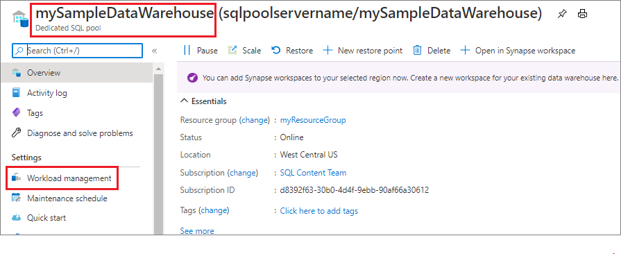
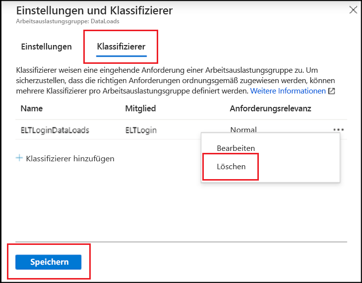

# <a name="quickstart-create-a-dedicated-sql-pool-workload-classifier-using-the-azure-portal"></a>Schnellstart: Erstellen eines Workloadklassifizierers für dedizierte SQL-Pools mithilfe des Azure-Portals

In dieser Schnellstartanleitung erstellen Sie einen [Workloadklassifizierer](sql-data-warehouse-workload-classification.md) zum Zuweisen von Abfragen zu einer Workloadgruppe.  Der Klassifizierer weist der Workloadgruppe `DataLoads` Anforderungen vom `ELTLogin`-SQL-Benutzer zu.   Führen Sie die Schritte unter [Schnellstart: Konfigurieren der Workloadisolation für Synapse SQL-Pools mithilfe einer Workloadgruppe im Azure-Portal](quickstart-configure-workload-isolation-portal.md) aus, um die Workloadgruppe `DataLoads` zu erstellen.  In diesem Tutorial wird ein Workloadklassifizierer mit der Option „WLM_LABEL“ erstellt, um die korrekte weitere Klassifizierung von Anforderungen zu unterstützen.  Der Klassifizierer weist diesen Anforderungen ebenfalls die [Workloadprioriät](sql-data-warehouse-workload-importance.md) `HIGH` zu.


Wenn Sie kein Azure-Abonnement besitzen, können Sie ein [kostenloses Konto](https://azure.microsoft.com/free/) erstellen, bevor Sie beginnen.


## <a name="sign-in-to-the-azure-portal"></a>Melden Sie sich auf dem Azure-Portal an.

Melden Sie sich beim [Azure-Portal](https://portal.azure.com/) an.

> [!NOTE]
> Das Erstellen einer Instanz des dedizierten SQL-Pools in Azure Synapse Analytics führt möglicherweise zu einem neuen abrechenbaren Dienst.  Weitere Informationen finden Sie unter [Azure Synapse Analytics – Preise](https://azure.microsoft.com/pricing/details/sql-data-warehouse/).

## <a name="prerequisites"></a>Voraussetzungen

In dieser Schnellstartanleitung wird vorausgesetzt, dass Sie bereits über eine Instanz des dedizierten SQL-Pools und über CONTROL DATABASE-Berechtigungen verfügen. Verwenden Sie die Anleitung unter [Erstellen und Verbinden – Portal](create-data-warehouse-portal.md), um bei Bedarf einen dedizierten SQL-Pool namens **mySampleDataWarehouse** zu erstellen.
<br><br>
Die Workloadgruppe `DataLoads` ist vorhanden.  Informationen zum Erstellen der Workloadgruppe finden Sie unter [Schnellstart: Konfigurieren der Workloadisolation für Synapse SQL-Pools mithilfe einer Workloadgruppe im Azure-Portal](quickstart-configure-workload-isolation-portal.md).
<br><br>
>[!IMPORTANT] 
>Der dedizierte SQL-Pool muss online sein, damit die Workloadverwaltung konfiguriert werden kann. 


## <a name="create-a-login-for-eltlogin"></a>Erstellen einer Anmeldung für „ELTLogin“

Erstellen Sie eine SQL Server-Authentifizierungsanmeldung in der `master`-Datenbank, indem Sie [CREATE LOGIN](/sql/t-sql/statements/create-login-transact-sql?toc=/azure/synapse-analytics/sql-data-warehouse/toc.json&bc=/azure/synapse-analytics/sql-data-warehouse/breadcrumb/toc.json&view=azure-sqldw-latest&preserve-view=true) für `ELTLogin` verwenden.

```sql
IF NOT EXISTS (SELECT * FROM sys.sql_logins WHERE name = 'ELTLogin')
BEGIN
CREATE LOGIN [ELTLogin] WITH PASSWORD='<strongpassword>'
END
;
```

## <a name="create-user-and-grant-permissions"></a>Erstellen eines Benutzers und Zuweisen von Berechtigungen

Nach der Erstellung der Anmeldung muss ein Benutzer in der Datenbank erstellt werden.  Verwenden Sie [CREATE USER](/sql/t-sql/statements/create-user-transact-sql?toc=/azure/synapse-analytics/sql-data-warehouse/toc.json&bc=/azure/synapse-analytics/sql-data-warehouse/breadcrumb/toc.json&view=azure-sqldw-latest&preserve-view=true), um das `ELTRole`-Objekt für den SQL-Benutzer in **mySampleDataWarehouse** zu erstellen.  Im Rahmen dieses Tutorials wird die Klassifizierung getestet. Gewähren Sie `ELTLogin` daher Berechtigungen für **mySampleDataWarehouse**. 

```sql
IF NOT EXISTS (SELECT * FROM sys.database_principals WHERE name = 'ELTLogin')
BEGIN
CREATE USER [ELTLogin] FOR LOGIN [ELTLogin]
GRANT CONTROL ON DATABASE::mySampleDataWarehouse TO ELTLogin 
END
;
```

## <a name="configure-workload-classification"></a>Konfigurieren der Workloadklassifizierung
Mithilfe der Klassifizierung können Sie Anforderungen, die auf verschiedenen Regeln basieren, an eine Workloadgruppe weiterleiten.  Im Tutorial [Schnellstart: Konfigurieren der Workloadisolation für Synapse SQL-Pools mithilfe einer Workloadgruppe im Azure-Portal](quickstart-configure-workload-isolation-portal.md) wurde die Workloadgruppe `DataLoads` erstellt.  Nun erstellen Sie einen Workloadklassifizierer, um Abfragen an die Workloadgruppe `DataLoads` weiterzuleiten.


1.  Navigieren Sie zur Seite des dedizierten SQL-Pools **mySampleDataWarehouse**.
3.  Wählen Sie **Workloadverwaltung** aus.

    

4.  Wählen Sie rechts neben der Workloadgruppe `DataLoads` die Option **Einstellungen und Klassifizierer** aus.

    

5. Wählen Sie in der Spalte „Klassifizierer“ die Option **Nicht konfiguriert** aus.
6. Wählen Sie **+ Klassifizierer hinzufügen** aus.

    

7.  Geben Sie unter **Name** den Namen `ELTLoginDataLoads` ein.
8.  Geben Sie unter **Mitglied** die Zeichenfolge `ELTLogin` ein.
9.  Wählen Sie unter **Anforderungsrelevanz** die Option `High` aus.  Dies ist *optional*. Standardmäßig ist normale Relevanz festgelegt.
10. Geben Sie unter **Bezeichnung** die Zeichenfolge `fact_loads` ein.
11. Wählen Sie **Hinzufügen**.
12. Wählen Sie **Speichern** aus.

    

## <a name="verify-and-test-classification"></a>Überprüfen und Testen der Klassifizierung
Überprüfen Sie in der Katalogsicht [sys.workload_management_workload_classifiers](/sql/relational-databases/system-catalog-views/sys-workload-management-workload-classifiers-transact-sql?view=azure-sqldw-latest&preserve-view=true), ob der Klassifizierer `ELTLoginDataLoads` vorhanden ist.

```sql
SELECT * FROM sys.workload_management_workload_classifiers WHERE name = 'ELTLoginDataLoads'
```

Überprüfen Sie in der Katalogansicht [sys.workload_management_workload_classifier_details](/sql/relational-databases/system-catalog-views/sys-workload-management-workload-classifier-details-transact-sql?view=azure-sqldw-latest&preserve-view=true) die Details zum Klassifizierer.

```sql
SELECT c.[name], c.group_name, c.importance, cd.classifier_type, cd.classifier_value
  FROM sys.workload_management_workload_classifiers c
  JOIN sys.workload_management_workload_classifier_details cd
    ON cd.classifier_id = c.classifier_id
  WHERE c.name = 'ELTLoginDataLoads'
```

Führen Sie die folgenden Anweisungen aus, um die Klassifizierung zu testen.  Stellen Sie sicher, dass Sie als ``ELTLogin`` verbunden sind und ``Label`` in der Abfrage verwendet wird.
```sql
CREATE TABLE factstaging (ColA int)
INSERT INTO factstaging VALUES(0)
INSERT INTO factstaging VALUES(1)
INSERT INTO factstaging VALUES(2)
GO

CREATE TABLE testclassifierfact WITH (DISTRIBUTION = ROUND_ROBIN)
AS
SELECT * FROM factstaging
OPTION (LABEL='fact_loads')
```

Überprüfen Sie die `CREATE TABLE`-Anweisung, die mithilfe des Workloadklassifizierers `ELTLoginDataLoads` für die Workloadgruppe `DataLoads` klassifiziert wurde.
```sql 
SELECT TOP 1 request_id, classifier_name, group_name, resource_allocation_percentage, submit_time, [status], [label], command 
FROM sys.dm_pdw_exec_requests 
WHERE [label] = 'fact_loads'
ORDER BY submit_time DESC
```

## <a name="clean-up-resources"></a>Bereinigen von Ressourcen

So löschen Sie den in diesem Tutorial erstellten Workloadklassifizierer `ELTLoginDataLoads`:

1. Klicken Sie rechts neben der Workloadgruppe `DataLoads` auf **1 Klassifizierer**.

    

2. Klicken Sie auf **Klassifizierer**.
3. Klicken Sie rechts neben dem Workloadklassifizierer `ELTLoginDataLoads` auf die Schaltfläche **`...`** .
4. Klicken Sie auf **Löschen**.
5. Klicken Sie auf **Speichern**.

    

Ihnen werden Gebühren für Data Warehouse-Einheiten und die in Ihrem dedizierten SQL-Pool gespeicherten Daten in Rechnung gestellt. Diese Compute- und Speicherressourcen werden separat in Rechnung gestellt.

- Falls Sie die Daten im Speicher belassen möchten, können Sie Computeressourcen anhalten, wenn Sie den dedizierten SQL-Pool nicht verwenden. Wenn Sie Computeressourcen anhalten, werden Ihnen nur die Datenspeichergebühren in Rechnung gestellt. Sie können die Computeressourcen fortsetzen, wenn Sie mit den Daten arbeiten möchten.
- Wenn künftig keine Gebühren mehr anfallen sollen, können Sie den dedizierten SQL-Pool löschen.

Führen Sie die folgenden Schritte aus, um Ressourcen zu bereinigen.

1. Melden Sie sich beim [Azure-Portal](https://portal.azure.com) an, und wählen Sie Ihren dedizierten SQL-Pool aus.

    

2. Wählen Sie zum Anhalten von Computeressourcen die Schaltfläche **Anhalten**. Wenn der dedizierte SQL-Pool angehalten ist, wird die Schaltfläche **Starten** angezeigt.  Wählen Sie zum Fortsetzen der Computeressourcen die Option **Starten**.

3. Wenn Sie den dedizierten SQL-Pool entfernen möchten, damit keine Gebühren für Compute- oder Speicherressourcen anfallen, wählen Sie **Löschen** aus.

## <a name="next-steps"></a>Nächste Schritte

Überwachen Sie Ihre Arbeitsauslastung anhand der Überwachungsmetriken im Azure-Portal.  Ausführliche Informationen finden Sie unter [Verwalten und Überwachen der Workloadpriorität in Azure Synapse Analytics](sql-data-warehouse-how-to-manage-and-monitor-workload-importance.md).
