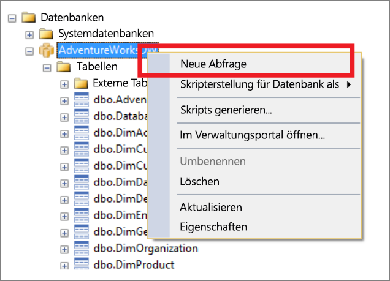
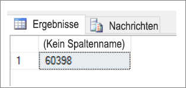

# <a name="connect-to-a-dedicated-sql-pool-in-azure-synapse-analytics-with-sql-server-management-studio-ssms"></a>Herstellen einer Verbindung mit einem dedizierten SQL-Pool in Azure Synapse Analytics mithilfe von SQL Server Management Studio (SSMS)

> [!div class="op_single_selector"]
>
> * [Power BI](sql-data-warehouse-get-started-visualize-with-power-bi.md)
> * [Azure Machine Learning](sql-data-warehouse-get-started-analyze-with-azure-machine-learning.md)
> * [Visual Studio](sql-data-warehouse-query-visual-studio.md)
> * [sqlcmd](sql-data-warehouse-get-started-connect-sqlcmd.md)
> * [SSMS](sql-data-warehouse-query-ssms.md)

Verwenden Sie SQL Server Management Studio (SSMS), um in Azure Synapse eine Verbindung mit einem Data Warehouse herzustellen und es abzufragen.

## <a name="prerequisites"></a>Voraussetzungen

Für dieses Tutorial benötigen Sie Folgendes:

* Einen vorhandenen dedizierten SQL-Pool. Informationen zu dessen Erstellung finden Sie unter [Erstellen eines dedizierten SQL-Pools](create-data-warehouse-portal.md).
* SQL Server Management Studio (SSMS) muss installiert sein. [Laden Sie SSMS kostenlos herunter](/sql/ssms/download-sql-server-management-studio-ssms?toc=/azure/synapse-analytics/sql-data-warehouse/toc.json&bc=/azure/synapse-analytics/sql-data-warehouse/breadcrumb/toc.json&view=azure-sqldw-latest), falls Sie noch nicht über die Anwendung verfügen.
* Den vollqualifizierten SQL-Servernamen. Informationen dazu finden Sie unter [Herstellen einer Verbindung mit einem dedizierten SQL-Pool](sql-data-warehouse-connect-overview.md).

## <a name="1-connect-to-your-dedicated-sql-pool"></a>1. Herstellen einer Verbindung mit Ihrem dedizierten SQL-Pool

1. Öffnen Sie SSMS.
2. Öffnen Sie den Objekt-Explorer, indem Sie **Datei**  > **Objekt-Explorer verbinden** auswählen.

    
3. Füllen Sie die Felder im Fenster zum Herstellen einer Verbindung mit dem Server aus.

   

   * **Servername**. Geben Sie den zuvor ermittelten **Servernamen** ein.
   * **Authentifizierung**. Wählen Sie SQL **Server-Authentifizierung** oder **Integrierte Active Directory-Authentifizierung**.
   * **Benutzername** und **Kennwort**. Geben Sie Benutzername und Kennwort ein, wenn Sie oben „SQL Server-Authentifizierung“ ausgewählt haben.
   * Klicken Sie auf **Verbinden**.
4. Erweitern Sie den Azure SQL-Server. Sie können die dem Server zugeordneten Datenbanken anzeigen. Erweitern Sie „AdventureWorksDW“, um die Tabellen in Ihrer Beispieldatenbank anzuzeigen.

   

## <a name="2-run-a-sample-query"></a>2. Ausführen einer Beispielabfrage

Nachdem jetzt eine Verbindung mit Ihrer Datenbank hergestellt wurde, schreiben wir eine Abfrage.

1. Klicken Sie mit der rechten Maustaste im SQL Server-Objekt-Explorer auf Ihre Datenbank.
2. Wählen Sie **Neue Abfrage** aus. Ein neues Abfragefenster wird geöffnet.

   
3. Kopieren Sie die folgende TSQL-Abfrage in das Abfragefenster:

   ```sql
   SELECT COUNT(*) FROM dbo.FactInternetSales;
   ```

4. Führen Sie die Abfrage aus, indem Sie auf `Execute` klicken oder die folgende Tastenkombination drücken: `F5`.

   
5. Sehen Sie sich die Abfrageergebnisse an. In diesem Beispiel weist die Tabelle „FactInternetSales“ 60398 Zeilen auf.

   

## <a name="next-steps"></a>Nächste Schritte

Nun da Sie eine Verbindung hergestellt haben und Abfragen senden können, versuchen Sie, [die Daten mit Power BI zu visualisieren](sql-data-warehouse-get-started-visualize-with-power-bi.md). Informationen zum Konfigurieren Ihrer Umgebung für die Azure Active Directory-Authentifizierung finden Sie unter [Authentifizieren beim dedizierten SQL-Pool](sql-data-warehouse-authentication.md).
