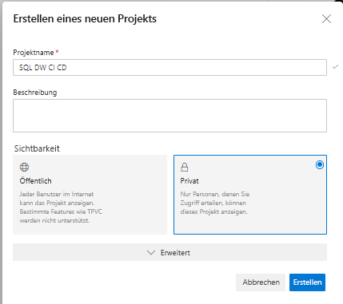
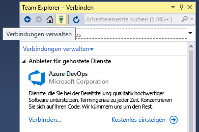
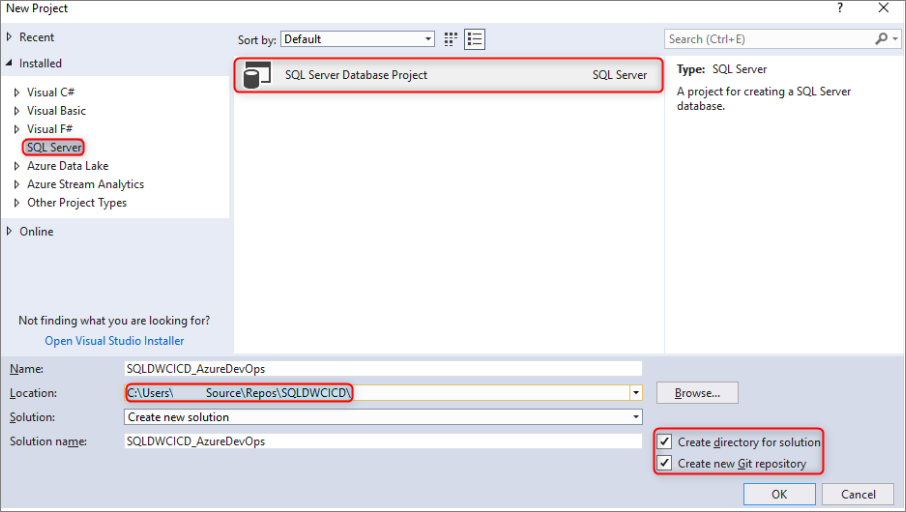
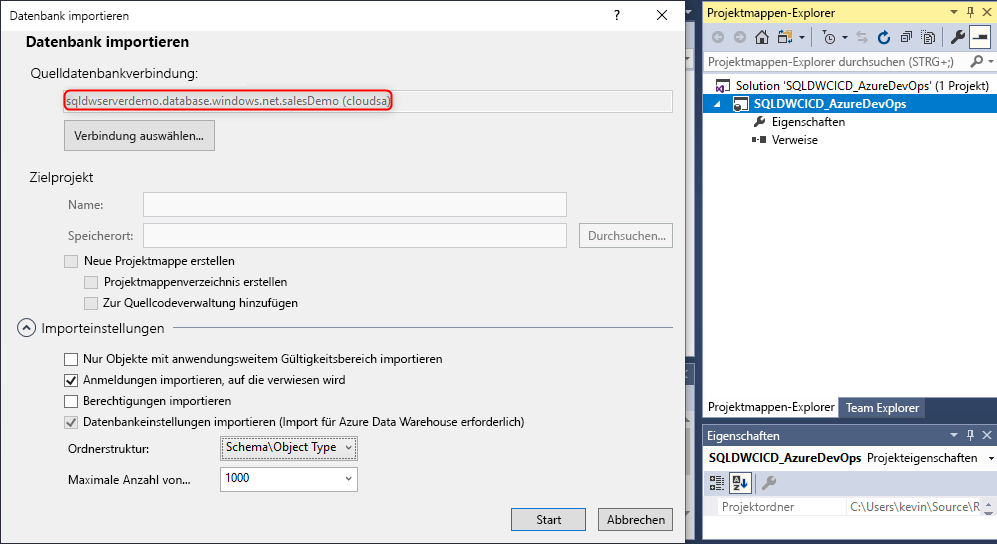
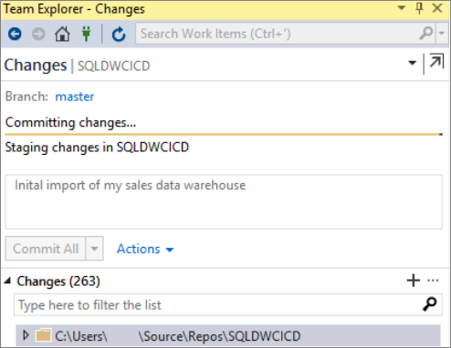
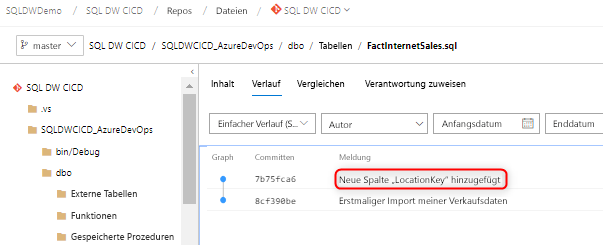

# Integration der Quellcodeverwaltung für den dedizierten SQL-Pool in Azure Synapse Analytics

In diesem Tutorial wird erläutert, wie Sie Ihr SSDT-Datenbankprojekt (SQL Server Data Tools) mit Quellcodeverwaltung integrieren.  Die Integration der Quellcodeverwaltung ist der erste Schritt bei der Erstellung Ihrer Continuous Integration- und Continuous Deployment-Pipeline mit der Ressource des dedizierten SQL-Pools in Azure Synapse Analytics.

## Voraussetzungen

- Registrieren für eine [Azure DevOps-Organisation](https://azure.microsoft.com/services/devops/)
- Absolvieren des Tutorials [Schnellstart: Erstellen und Abfragen einer Azure SQL Data Warehouse-Instanz im Azure-Portal](create-data-warehouse-portal.md)
- [Installieren von Visual Studio 2019](https://visualstudio.microsoft.com/vs/older-downloads/)

## Einrichten von Azure DevOps und Herstellen einer Verbindung

1. Erstellen Sie in Ihrer Azure DevOps-Organisation ein Projekt, von dem Ihr SSDT-Datenbankprojekt über ein Azure-Repository gehostet wird.

   

2. Öffnen Sie Visual Studio, und stellen Sie mit Ihrer Azure DevOps-Organisation und Ihrem Projekt aus Schritt 1 eine Verbindung her, indem Sie **Verbindung verwalten** auswählen.

   

3. Stellen Sie eine Verbindung mit Ihrem Projekt her, indem Sie **Verbindungen verwalten** und dann **Verbindung mit einem Projekt herstellen** auswählen.
 
    

4. Suchen Sie das Projekt, das Sie in Schritt 1 erstellt haben, und wählen Sie **Verbinden** aus.
 
    

3. Klonen Sie das Azure-DevOps-Repository aus Ihrem Projekt auf dem lokalen Computer.

   

Weitere Informationen zum Verbinden von Projekten mithilfe von Visual Studio finden Sie im Thema zum [Herstellen einer Verbindung mit Projekten im Team Explorer](/visualstudio/ide/connect-team-project?view=vs-2019&preserve-view=true). Anleitungen zum Klonen eines Repositorys mithilfe von Visual Studio finden Sie im Artikel [Klonen eines vorhandenen Git-Repositorys](/azure/devops/repos/git/clone?tabs=visual-studio&view=azure-devops&preserve-view=true). 

## Erstellen und Verbinden Ihres Projekts

1. Erstellen Sie in Visual Studio ein neues SQL Server-Datenbankprojekt mit einem Verzeichnis und einem lokalen Git-Repository in Ihrem **lokalen geklonten Repository**.

     

2. Klicken Sie mit der rechten Maustaste auf das leere SQL-Projekt, und importieren Sie Ihr Data Warehouse in das Datenbankprojekt.

     

3. Committen Sie im Team Explorer in Visual Studio Ihre Änderungen im lokalen Git-Repository.

     

4. Nachdem Sie die Änderungen lokal im geklonten Repository committet haben, synchronisieren Sie die Änderungen, und pushen Sie sie in das Azure-Repository in Ihrem Azure DevOps-Projekt.

   

     

## Überprüfen

1. Überprüfen Sie, ob die Änderungen in das Azure-Repository gepusht wurden, indem Sie eine Tabellenspalte in Ihrem Datenbankprojekt über Visual Studio SQL Server Data Tools (SSDT) aktualisieren.

   

2. Committen und pushen Sie die Änderung von Ihrem lokalen Repository in das Azure-Repository.

   

3. Überprüfen Sie, ob die Änderung in Ihr Azure-Repository gepusht wurde.

   

4. (**Optional**) Verwenden Sie den Schemavergleich, und aktualisieren Sie mithilfe von SSDT die Änderungen an Ihrem dedizierten SQL-Zielpool, um sicherzustellen, dass die Objektdefinitionen in Ihrem Azure-Repository und im lokalen Repository Ihren dedizierten SQL-Pool widerspiegeln.

## Nächste Schritte

- [Entwickeln für den dedizierten SQL-Pool](sql-data-warehouse-overview-develop.md)