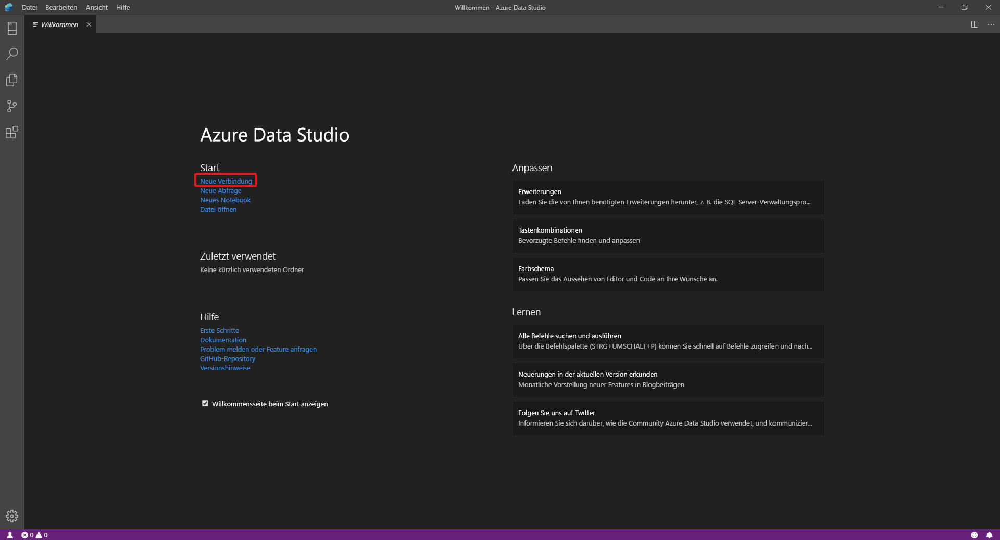
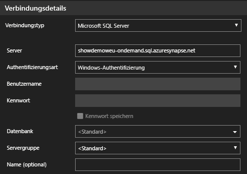
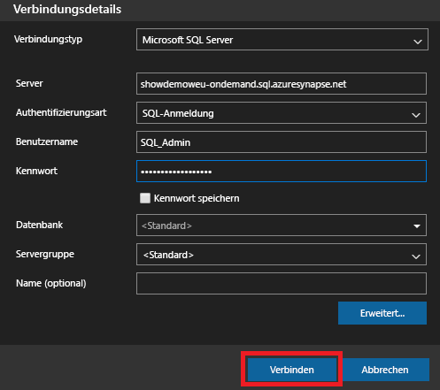
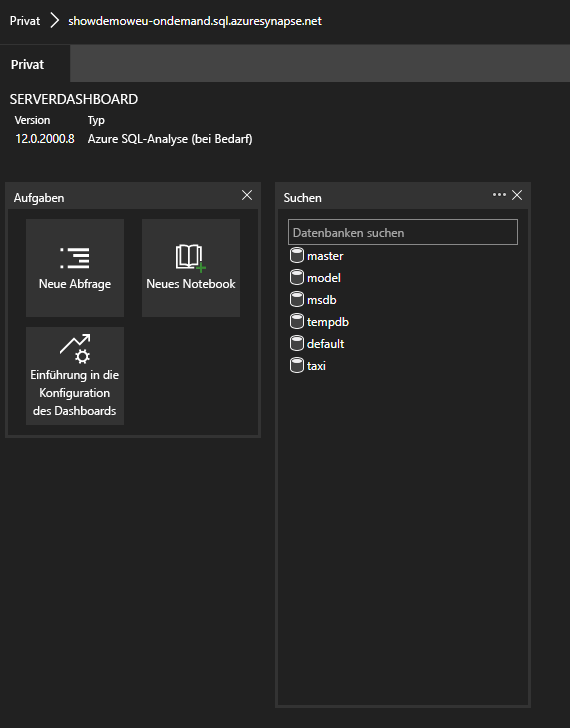
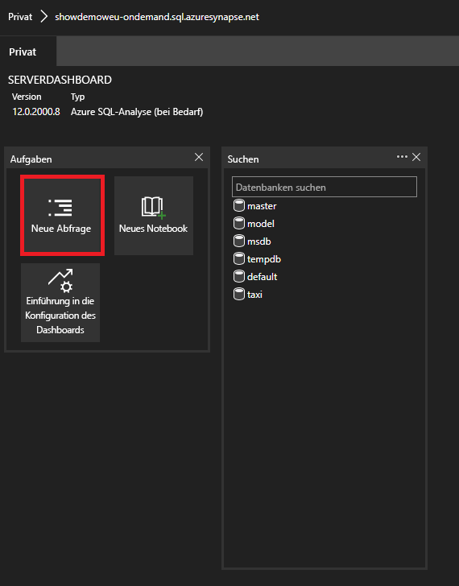

# <a name="connect-to-synapse-sql-with-azure-data-studio-preview"></a>Herstellen einer Verbindung mit Synapse SQL über Azure Data Studio (Vorschau)

> [!div class="op_single_selector"]
>
> * [Azure Data Studio](get-started-azure-data-studio.md)
> * [Power BI](get-started-power-bi-professional.md)
> * [Visual Studio](../sql-data-warehouse/sql-data-warehouse-query-visual-studio.md?toc=/azure/synapse-analytics/toc.json&bc=/azure/synapse-analytics/breadcrumb/toc.json)
> * [sqlcmd](get-started-connect-sqlcmd.md)
> * [SSMS](get-started-ssms.md)

Sie können [Azure Data Studio (Vorschau)](/sql/azure-data-studio/download-azure-data-studio?toc=/azure/synapse-analytics/toc.json&bc=/azure/synapse-analytics/breadcrumb/toc.json&view=azure-sqldw-latest) verwenden, um eine Verbindung mit Synapse SQL in Azure Synapse Analytics herzustellen und Abfragen auszuführen. 

## <a name="connect"></a>Verbinden

Um eine Verbindung mit Synapse SQL herzustellen, öffnen Sie Azure Data Studio und wählen **Neue Verbindung** aus.



Wählen Sie **Microsoft SQL Server** als **Verbindungstyp** aus.

Die Verbindung erfordert die folgenden Parameter:

* **Server:** Server im Format `<Azure Synapse workspace name>`-ondemand.sql.azuresynapse.net
* **Datenbank:** Datenbankname

> [!NOTE]
> Wenn Sie einen **serverlosen SQL-Pool (Vorschauversion)** verwenden möchten, sollte die URL wie folgt aussehen:
>
> - `<Azure Synapse workspace name>`-ondemand.sql.azuresynapse.net.
>
> Wenn Sie einen **dedizierten SQL-Pool** verwenden möchten, sollte die URL wie folgt aussehen:
>
> - `<Azure Synapse workspace name>`.sql.azuresynapse.net

Wählen Sie **Windows-Authentifizierung**, **Azure Active Directory** oder **SQL-Anmeldung** als **Authentifizierungstyp** aus.

Um **SQL-Anmeldung** als Authentifizierungstyp zu verwenden, müssen Sie die Parameter für Benutzername und Kennwort hinzufügen:

* **Benutzer:** Serverbenutzer im Format `<User>`
* **Kennwort:** Das Kennwort des Benutzers

Für die Verwendung von Azure Active Directory müssen Sie den erforderlichen Authentifizierungstyp auswählen.


Der folgende Screenshot zeigt die **Verbindungsdetails** für die **Windows-Authentifizierung**:



Der folgende Screenshot zeigt die **Verbindungsdetails** für die **SQL-Anmeldung**:



Nach der erfolgreicher Anmeldung sollte ein Dashboard wie das folgende angezeigt werden: 

## <a name="query"></a>Abfrage

Nach dem Herstellen der Verbindung können Sie Synapse SQL mithilfe von unterstützten [Transact-SQL](/sql/t-sql/language-reference?toc=/azure/synapse-analytics/toc.json&bc=/azure/synapse-analytics/breadcrumb/toc.json&view=azure-sqldw-latest)-Anweisungen (T-SQL) für die Instanz abfragen. Klicken Sie auf dem Dashboard auf **Neue Abfrage**, um zu beginnen.



Sie können beispielsweise die folgende Transact-SQL-Anweisung verwenden, um mithilfe eines serverlosen SQL-Pools [Parquet-Dateien abzufragen](query-parquet-files.md):

```sql
SELECT COUNT(*)
FROM  
OPENROWSET(
    BULK 'https://azureopendatastorage.blob.core.windows.net/censusdatacontainer/release/us_population_county/year=20*/*.parquet',
    FORMAT='PARQUET'
)
```
## <a name="next-steps"></a>Nächste Schritte 
Erkunden Sie weitere Möglichkeiten zum Herstellen einer Verbindung mit Synapse SQL: 

- [SSMS](get-started-ssms.md)
- [Power BI](get-started-power-bi-professional.md)
- [Visual Studio](../sql-data-warehouse/sql-data-warehouse-query-visual-studio.md?toc=/azure/synapse-analytics/toc.json&bc=/azure/synapse-analytics/breadcrumb/toc.json)
- [sqlcmd](get-started-connect-sqlcmd.md)

Besuchen Sie [Verwenden von Azure Data Studio zum Verbinden mit und Abfragen von Daten mithilfe eines dedizierten SQL-Pools in Azure Synapse Analytics](https://docs.microsoft.com/sql/azure-data-studio/quickstart-sql-dw), um weitere Informationen zu erhalten. 
