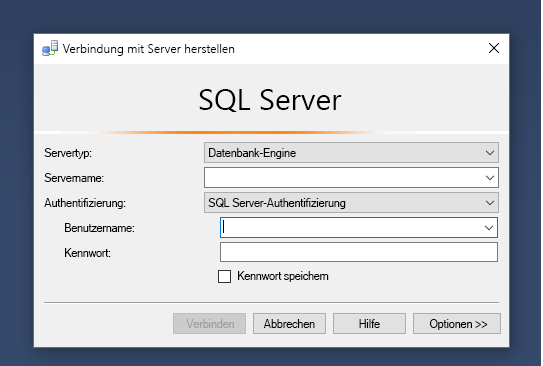
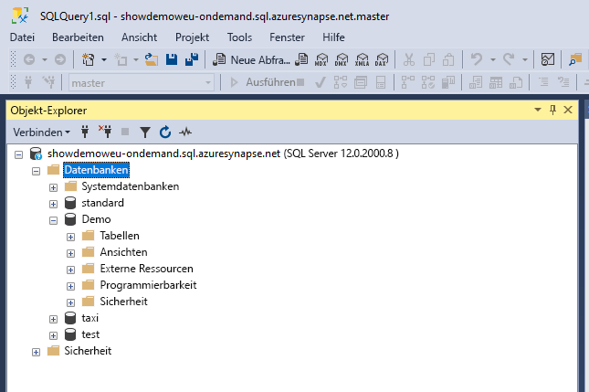
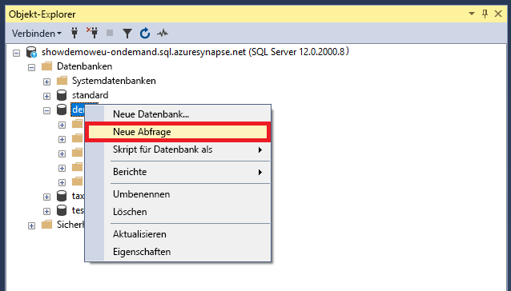

# <a name="connect-to-synapse-sql-with-sql-server-management-studio-ssms"></a>Herstellen einer Verbindung mit Synapse SQL mithilfe von SQL Server Management Studio (SSMS)
> [!div class="op_single_selector"]
> * [Azure Data Studio](get-started-azure-data-studio.md)
> * [Power BI](get-started-power-bi-professional.md)
> * [Visual Studio](../sql-data-warehouse/sql-data-warehouse-query-visual-studio.md?toc=/azure/synapse-analytics/toc.json&bc=/azure/synapse-analytics/breadcrumb/toc.json)
> * [sqlcmd](../sql/get-started-connect-sqlcmd.md)
> * [SSMS](get-started-ssms.md)
> 
> 

Sie können mithilfe von [SQL Server Management Studio (SSMS)](/sql/ssms/download-sql-server-management-studio-ssms) entweder über SQL On-Demand (Vorschauversion) oder SQL-Poolressourcen eine Verbindung mit Synapse SQL in Azure Synapse Analytics herstellen und Abfragen durchführen. 

### <a name="supported-tools-for-sql-on-demand-preview"></a>Unterstützte Tools für SQL On-Demand (Vorschauversion)

[Azure Data Studio](/sql/azure-data-studio/download-azure-data-studio) wird ab Version 1.18.0 vollständig unterstützt. SSMS wird ab Version 18.5 teilweise unterstützt, kann aber nur zum Herstellen einer Verbindung und für Abfragen verwendet werden.

> [!NOTE]
> Wenn die Verbindung bei einer AAD-Anmeldung zum Zeitpunkt der Abfrageausführung länger als eine Stunde geöffnet bleibt, schlägt jede auf AAD basierende Abfrage fehl. Dazu gehört das Abfragen von Speicher mit AAD-Pass-Through und Anweisungen, die mit AAD interagieren (z. B. CREATE EXTERNAL PROVIDER). Dies wirkt sich auf jedes Tool aus, das die Verbindung geöffnet hält, wie beim Abfrage-Editor in SSMS und ADS. Tools wie Synapse Studio, die eine neue Verbindung zur Ausführung einer Abfrage öffnen, sind davon nicht betroffen.
> Zur Behebung dieses Problems können Sie SSMS neu starten oder in ADS eine Verbindung herstellen und trennen. erforderlich.
## <a name="prerequisites"></a>Voraussetzungen

Bevor Sie beginnen, stellen Sie sicher, dass die folgenden Voraussetzungen erfüllt sind:  

* [SQL Server Management Studio (SSMS)](/sql/ssms/download-sql-server-management-studio-ssms). 
* Für den SQL-Pool benötigen Sie ein vorhandenes Data Warehouse. Informationen zur Erstellung finden Sie unter [Erstellen eines SQL-Pools](../quickstart-create-sql-pool-portal.md). Bei SQL On-Demand wird bereits bei der Erstellung ein Data Warehouse in Ihrem Arbeitsbereich bereitgestellt. 
* Den vollqualifizierten SQL Server-Namen. Informationen, wie dieser Name ermittelt wird, finden Sie unter [Herstellen einer Verbindung mit Synapse SQL](connect-overview.md).

## <a name="connect"></a>Verbinden

### <a name="sql-pool"></a>SQL-Pool

Führen Sie die folgenden Schritte aus, um mithilfe des SQL-Pools eine Verbindung mit Synapse SQL herzustellen: 

1. Öffnen Sie SQL Server Management Studio (SSMS). 
1. Füllen Sie im Dialogfeld **Mit Server verbinden** die Felder aus, und wählen Sie dann **Verbinden** aus: 
  
    
   
   * **Servername**: Geben Sie den zuvor ermittelten **Servernamen** ein.
   * **Authentifizierung:**  Wählen Sie einen Authentifizierungstyp aus, etwa **SQL Server-Authentifizierung** oder **Integrierte Active Directory-Authentifizierung**.
   * **Benutzername** und **Kennwort**: Geben Sie Benutzername und Kennwort ein, wenn Sie oben „SQL Server-Authentifizierung“ ausgewählt haben.

1. Erweitern Sie Ihre Azure SQL Server-Instanz im **Objekt-Explorer**. Sie können die dem Server zugeordneten Datenbanken anzeigen, etwa die Beispieldatenbank „AdventureWorksDW“. Sie können die Datenbank erweitern, um die Tabellen anzuzeigen:
   
    


### <a name="sql-on-demand-preview"></a>SQL On-Demand (Vorschauversion)

Führen Sie die folgenden Schritte aus, um mithilfe von SQL On-Demand eine Verbindung mit Synapse SQL herzustellen: 

1. Öffnen Sie SQL Server Management Studio (SSMS).
1. Füllen Sie im Dialogfeld **Mit Server verbinden** die Felder aus, und wählen Sie dann **Verbinden** aus: 
   
    
   
   * **Servername**: Geben Sie den zuvor ermittelten **Servernamen** ein.
   * **Authentifizierung:** Wählen Sie einen Authentifizierungstyp aus, etwa **SQL Server-Authentifizierung** oder **Integrierte Active Directory-Authentifizierung**.
   * **Benutzername** und **Kennwort**: Geben Sie Benutzername und Kennwort ein, wenn Sie oben „SQL Server-Authentifizierung“ ausgewählt haben.
   * Wählen Sie **Verbinden** aus.

4. Erweitern Sie den Azure SQL-Server. Sie können die dem Server zugeordneten Datenbanken anzeigen. Erweitern Sie *Demo*, um den Inhalt in der Beispieldatenbank anzuzeigen.
   
    


## <a name="run-a-sample-query"></a>Ausführen einer Beispielabfrage

### <a name="sql-pool"></a>SQL-Pool

Nachdem eine Datenbankverbindung hergestellt wurde, können Sie die Daten nun abfragen.

1. Klicken Sie mit der rechten Maustaste im SQL Server-Objekt-Explorer auf Ihre Datenbank.
2. Wählen Sie **Neue Abfrage** aus. Ein neues Abfragefenster wird geöffnet.
   
    
3. Kopieren Sie die folgende TSQL-Abfrage in das Abfragefenster:
   
    ```sql
    SELECT COUNT(*) FROM dbo.FactInternetSales;
    ```
4. Führen Sie die Abfrage aus, indem Sie `Execute` auswählen oder die folgende Tastenkombination drücken: `F5`.
   
    
5. Sehen Sie sich die Abfrageergebnisse an. Im folgenden Beispiel hat die Tabelle „FactInternetSales“ 60398 Zeilen.
   
    

### <a name="sql-on-demand"></a>SQL On-Demand

Nachdem eine Datenbankverbindung hergestellt wurde, können Sie die Daten nun abfragen.

1. Klicken Sie mit der rechten Maustaste im SQL Server-Objekt-Explorer auf Ihre Datenbank.
2. Wählen Sie **Neue Abfrage** aus. Ein neues Abfragefenster wird geöffnet.
   
    
3. Kopieren Sie die folgende TSQL-Abfrage in das Abfragefenster:
   
    ```sql
    SELECT COUNT(*) FROM demo.dbo.usPopulationView
    ```
4. Führen Sie die Abfrage aus, indem Sie `Execute` auswählen oder die folgende Tastenkombination drücken: `F5`.
   
    
5. Sehen Sie sich die Abfrageergebnisse an. In diesem Beispiel enthält die Ansicht „usPopulationView“ 3.664.512 Zeilen.
   
    

## <a name="next-steps"></a>Nächste Schritte
Nun da Sie eine Verbindung hergestellt haben und Abfragen senden können, versuchen Sie, [die Daten mit Power BI zu visualisieren](get-started-power-bi-professional.md).

Informationen zum Konfigurieren der Umgebung für die Azure Active Directory-Authentifizierung finden Sie unter [Authentifizieren bei Azure Synapse Analytics](../sql-data-warehouse/sql-data-warehouse-authentication.md?toc=/azure/synapse-analytics/toc.json&bc=/azure/synapse-analytics/breadcrumb/toc.json).

