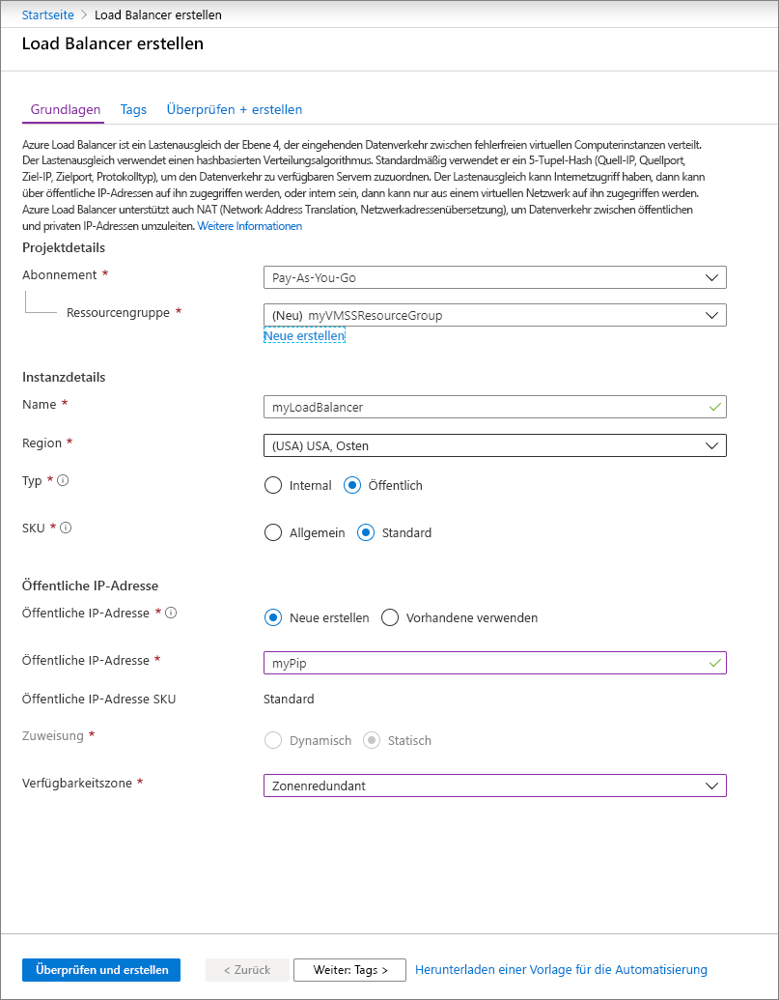

# Schnellstart: Erstellen einer VM-Skalierungsgruppe im Azure-Portal

Mit einer VM-Skalierungsgruppe können Sie eine Gruppe automatisch skalierender virtueller Computer bereitstellen und verwalten. Sie können die Anzahl virtueller Computer in der Skalierungsgruppe manuell skalieren oder basierend auf der Ressourcennutzung, z.B. CPU-Auslastung, Speicherbedarf oder Netzwerkdatenverkehr, Regeln für die automatische Skalierung definieren. Daraufhin wird der Datenverkehr durch einen Azure-Lastenausgleich auf die VM-Instanzen in der Skalierungsgruppe verteilt. In dieser Schnellstartanleitung erstellen Sie eine VM-Skalierungsgruppe über das Azure-Portal.

Wenn Sie kein Azure-Abonnement besitzen, können Sie ein [kostenloses Konto](https://azure.microsoft.com/free/?WT.mc_id=A261C142F) erstellen, bevor Sie beginnen.

## Anmelden an Azure
Melden Sie sich unter https://portal.azure.com beim Azure-Portal an.

## Einrichten eines Load Balancers

Azure [Load Balancer](../load-balancer/load-balancer-overview.md) verteilt eingehenden Datenverkehr auf fehlerfreie VM-Instanzen. 

Erstellen Sie zunächst eine Load Balancer Standard-Instanz über das Portal. Der von Ihnen erstellte Name und die öffentliche IP-Adresse werden automatisch als Front-End des Load Balancers konfiguriert.

1. Geben Sie im Suchfeld den Suchbegriff **Load Balancer** ein. Wählen Sie unter **Marketplace** in den Suchergebnissen **Load Balancer** aus.
1. Geben Sie auf der Seite **Lastenausgleich erstellen** auf der Registerkarte **Grundlagen** die folgenden Informationen ein, bzw. wählen Sie sie aus:

    | Einstellung                 | Wert   |
    | ---| ---|
    | Subscription  | Wählen Sie Ihr Abonnement aus.    |    
    | Resource group | Wählen Sie **Neu erstellen** aus, und geben Sie *myVMSSResourceGroup* in das Textfeld ein.|
    | Name           | *myLoadBalancer*         |
    | Region         | Wählen Sie **USA, Osten** aus.       |
    | type          | Wählen Sie **Öffentlich** aus.       |
    | SKU           | Wählen Sie **Standard** aus.       |
    | Öffentliche IP-Adresse | Wählen Sie **Neu erstellen**. |
    | Name der öffentlichen IP-Adresse  | *myPip*   |
    | Zuweisung| statischen |
    | Verfügbarkeitszone | Wählen Sie **Zonenredundant** aus. |

1. Wählen Sie abschließend **Überprüfen + Erstellen** aus. 
1. Wählen Sie nach der erfolgreichen Überprüfung **Erstellen** aus. 

## Erstellen einer VM-Skalierungsgruppe
Sie können eine Skalierungsgruppe mit einem Windows Server-Image oder Linux-Image wie RHEL, CentOS, Ubuntu oder SLES bereitstellen.

1. Geben Sie **Skalierungsgruppe** in das Suchfeld ein. Wählen Sie in den Ergebnissen unter **Marketplace** den Eintrag **VM-Skalierungsgruppen** aus. Wählen Sie auf der Seite **VM-Skalierungsgruppen** die Option **Erstellen** aus. Dadurch wird die Seite **VM-Skalierungsgruppe erstellen** geöffnet. 
1. Stellen Sie auf der Registerkarte **Grundlagen** unter **Projektdetails** sicher, dass das richtige Abonnement ausgewählt ist, und wählen Sie dann **Neu erstellen** für „Ressourcengruppe“ aus. Geben Sie *myVMSSResourceGroup* als Name ein, und wählen Sie dann **OK** aus. 
1. Geben Sie *myScaleSet* als Name für die Skalierungsgruppe ein.
1. Wählen Sie unter **Region** eine Region in Ihrer Nähe aus.
1. Wählen Sie unter **Image** ein Marketplace-Image aus. In diesem Beispiel wurde *Ubuntu Server 18.04 LTS* ausgewählt.
1. Geben Sie den gewünschten Benutzernamen ein, und wählen Sie den bevorzugten Authentifizierungstyp aus.
   - Ein **Kennwort** muss 12 Zeichen lang sein und zur Erfüllung der Komplexitätsanforderungen drei der folgenden vier Elemente enthalten: einen Kleinbuchstaben, einen Großbuchstaben, eine Zahl und ein Sonderzeichen. Weitere Informationen finden Sie im Artikel zu den [Anforderungen an Benutzernamen und Kennwörter](../virtual-machines/windows/faq.md#what-are-the-username-requirements-when-creating-a-vm).
   - Wenn Sie ein Datenträgerimage für Linux-Betriebssysteme auswählen, können Sie stattdessen einen **öffentlichen SSH-Schlüssel** auswählen. Geben Sie nur Ihren öffentlichen Schlüssel an (z.B. *~/.ssh/id_rsa.pub*). Sie können Azure Cloud Shell aus dem Portal verwenden, um [SSH-Schlüssel zu erstellen und zu verwenden](../virtual-machines/linux/mac-create-ssh-keys.md).
   
    :::image type="content" source="./media/virtual-machine-scale-sets-create-portal/quick-create-scale-set.png" alt-text="Abbildung: Erstellungsoptionen für Skalierungsgruppen im Azure-Portal":::

1. Wählen Sie **Weiter** aus, um mit den nächsten Seiten fortzufahren. 
1. Übernehmen Sie auf den Seiten **Instanz** und **Datenträger** die Standardwerte.
1. Wählen Sie auf der Seite **Netzwerk** unter **Lastenausgleich** die Option **Ja** aus, um die Skalierungsgruppeninstanzen hinter einem Lastenausgleich zu platzieren. 
1. Wählen Sie unter **Optionen für den Lastenausgleich** die Option **Azure Load Balancer** aus.
1. Wählen Sie unter **Load Balancer auswählen** den zuvor erstellten Lastenausgleich *myLoadBalancer* aus.
1. Wählen Sie unter **Back-End-Pool auswählen** die Option **Neuen erstellen** aus, geben Sie *myBackendPool* ein, und wählen Sie dann **Erstellen** aus.
1. Wählen Sie abschließend **Überprüfen + Erstellen** aus. 
1. Wählen Sie nach der erfolgreichen Überprüfung **Erstellen** aus, um die Skalierungsgruppe bereitzustellen.

## Bereinigen von Ressourcen
Wenn Ressourcengruppe, Skalierungsgruppe und alle zugehörigen Ressourcen nicht mehr benötigt werden, löschen Sie sie. Wählen Sie hierzu die Ressourcengruppe für die Skalierungsgruppe und anschließend **Löschen** aus.

## Nächste Schritte
In dieser Schnellstartanleitung haben Sie eine einfache Skalierungsgruppe über das Azure-Portal erstellt. Im nächsten Tutorial erfahren Sie mehr über die Erstellung und Verwaltung von Azure-VM-Skalierungsgruppen.

> [!div class="nextstepaction"]
> [Erstellen und Verwalten von Azure-VM-Skalierungsgruppen](tutorial-create-and-manage-powershell.md)
