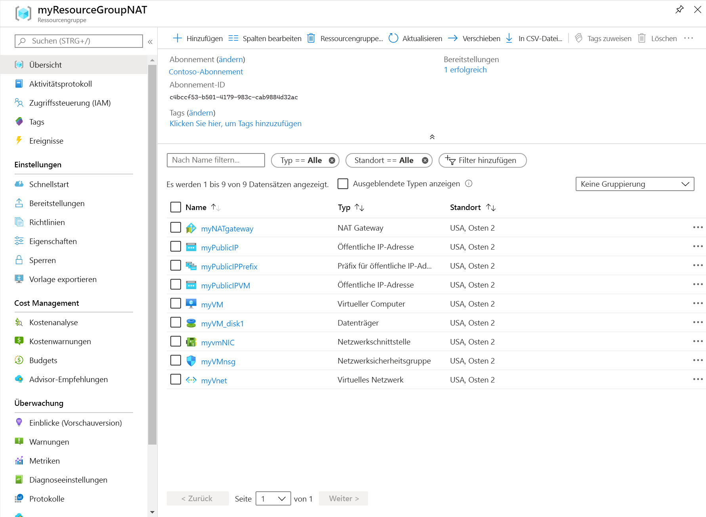

# <a name="quickstart-create-a-nat-gateway---arm-template"></a>Schnellstart: Erstellen einer NAT Gateway-Instanz: ARM-Vorlage

Hier finden Sie Informationen zu den ersten Schritten mit Virtual Network NAT unter Verwendung einer Azure Resource Manager-Vorlage (ARM-Vorlage). Mit dieser Vorlage werden ein virtuelles Netzwerk, eine NAT-Gatewayressource und ein virtueller Ubuntu-Computer bereitgestellt. Der virtuelle Ubuntu-Computer wird in einem Subnetz bereitgestellt, das der NAT-Gatewayressource zugeordnet ist.

[!INCLUDE [About Azure Resource Manager](../../includes/resource-manager-quickstart-introduction.md)]

Wenn Ihre Umgebung die Voraussetzungen erfüllt und Sie mit der Verwendung von ARM-Vorlagen vertraut sind, klicken Sie auf die Schaltfläche **In Azure bereitstellen**. Die Vorlage wird im Azure-Portal geöffnet.

[](https://portal.azure.com/#create/Microsoft.Template/uri/https%3A%2F%2Fraw.githubusercontent.com%2FAzure%2Fazure-quickstart-templates%2Fmaster%2Fquickstarts%2Fmicrosoft.network%2Fnat-gateway-1-vm%2Fazuredeploy.json)

## <a name="prerequisites"></a>Voraussetzungen

Wenn Sie kein Azure-Abonnement besitzen, können Sie ein [kostenloses Konto](https://azure.microsoft.com/free/?WT.mc_id=A261C142F) erstellen, bevor Sie beginnen.

## <a name="review-the-template"></a>Überprüfen der Vorlage

Die in dieser Schnellstartanleitung verwendete Vorlage stammt von der Seite mit den [Azure-Schnellstartvorlagen](https://azure.microsoft.com/resources/templates/101-nat-gateway-1-vm).

Diese Vorlage ist für die Erstellung der folgenden Elemente konfiguriert:

* Virtuelles Netzwerk
* NAT-Gatewayressource
* Virtueller Ubuntu-Computer

Der virtuelle Ubuntu-Computer wird in einem Subnetz bereitgestellt, das der NAT-Gatewayressource zugeordnet ist.

:::code language="json" source="~/quickstart-templates/quickstarts/microsoft.network/nat-gateway-1-vm/azuredeploy.json":::

In der Vorlage sind neun Azure-Ressourcen definiert:

* **[Microsoft.Network/networkSecurityGroups](/azure/templates/microsoft.network/networksecuritygroups)** : Erstellt eine Netzwerksicherheitsgruppe.
* **[Microsoft.Network/networkSecurityGroups/securityRules](/azure/templates/microsoft.network/networksecuritygroups/securityrules)** : Erstellt eine Sicherheitsregel.
* **[Microsoft.Network/publicIPAddresses](/azure/templates/microsoft.network/publicipaddresses)** : Erstellt eine öffentliche IP-Adresse.
* **[Microsoft.Network/publicIPPrefixes](/azure/templates/microsoft.network/publicipprefixes)** : Erstellt ein Präfix für öffentliche IP-Adressen.
* **[Microsoft.Compute/virtualMachines](/azure/templates/Microsoft.Compute/virtualMachines)** : Erstellt einen virtuellen Computer.
* **[Microsoft.Network/virtualNetworks](/azure/templates/microsoft.network/virtualnetworks)** : Erstellen Sie ein virtuelles Netzwerk.
* **[Microsoft.Network/natGateways](/azure/templates/microsoft.network/natgateways)** : Erstellt eine NAT-Gatewayressource.
* **[Microsoft.Network/virtualNetworks/subnets](/azure/templates/microsoft.network/virtualnetworks/subnets)** : Erstellt ein Subnetz für virtuelle Netzwerke.
* **[Microsoft.Network/networkinterfaces](/azure/templates/microsoft.network/networkinterfaces)** : Erstellt eine Netzwerkschnittstelle.

## <a name="deploy-the-template"></a>Bereitstellen der Vorlage

**Azure-Befehlszeilenschnittstelle**

```azurecli-interactive
read -p "Enter the location (i.e. westcentralus): " location
resourceGroupName="myResourceGroupNAT"
templateUri="https://raw.githubusercontent.com/Azure/azure-quickstart-templates/master/quickstarts/microsoft.network/nat-gateway-1-vm/azuredeploy.json"

az group create \
--name $resourceGroupName \
--location $location

az deployment group create \
--resource-group $resourceGroupName \
--template-uri  $templateUri
```

**Azure PowerShell**

```azurepowershell-interactive
$location = Read-Host -Prompt "Enter the location (i.e. westcentralus)"
$templateUri = "https://raw.githubusercontent.com/Azure/azure-quickstart-templates/master/quickstarts/microsoft.network/nat-gateway-1-vm/azuredeploy.json"

$resourceGroupName = "myResourceGroupNAT"

New-AzResourceGroup -Name $resourceGroupName -Location $location
New-AzResourceGroupDeployment -ResourceGroupName $resourceGroupName -TemplateUri $templateUri
```

**Azure portal**

[](https://portal.azure.com/#create/Microsoft.Template/uri/https%3A%2F%2Fraw.githubusercontent.com%2FAzure%2Fazure-quickstart-templates%2Fmaster%2Fquickstarts%2Fmicrosoft.network%2Fnat-gateway-1-vm%2Fazuredeploy.json)

## <a name="review-deployed-resources"></a>Überprüfen der bereitgestellten Ressourcen

1. Melden Sie sich beim [Azure-Portal](https://portal.azure.com) an.

1. Wählen Sie im linken Bereich **Ressourcengruppen** aus.

1. Wählen Sie die Ressourcengruppe aus, die Sie im vorherigen Abschnitt erstellt haben. Der Ressourcengruppenname lautet standardmäßig **myResourceGroupNAT**.

1. Vergewissern Sie sich, dass die folgenden Ressourcen in der Ressourcengruppe erstellt wurden:

    

## <a name="clean-up-resources"></a>Bereinigen von Ressourcen

**Azure-Befehlszeilenschnittstelle**

Wenn die Ressourcengruppe und alle darin enthaltenen Ressourcen nicht mehr benötigt werden, können Sie sie mit dem Befehl [az group delete](/cli/azure/group#az_group_delete) entfernen.

```azurecli-interactive
  az group delete \
    --name myResourceGroupNAT
```

**Azure PowerShell**

Wenn die Ressourcengruppe und alle darin enthaltenen Ressourcen nicht mehr benötigt werden, können Sie sie mit dem Befehl [Remove-AzResourceGroup](/powershell/module/az.resources/remove-azresourcegroup) entfernen.

```azurepowershell-interactive
Remove-AzResourceGroup -Name myResourceGroupNAT
```

**Azure portal**

Löschen Sie die Ressourcengruppe, das NAT-Gateway und alle dazugehörigen Ressourcen, wenn Sie sie nicht mehr benötigen. Wählen Sie die Ressourcengruppe **myResourceGroupNAT** aus, die das NAT-Gateway enthält, und wählen Sie anschließend **Löschen** aus.

## <a name="next-steps"></a>Nächste Schritte

In dieser Schnellstartanleitung haben Sie Folgendes erstellt:

* NAT-Gatewayressource
* Virtuelles Netzwerk
* Virtueller Ubuntu-Computer

Der virtuelle Computer wird in einem VNET-Subnetz bereitgestellt, das dem NAT-Gateway zugeordnet ist.

Weitere Informationen zu Virtual Network NAT und Azure Resource Manager finden Sie in den folgenden Artikeln:

* [Was ist Virtual Network NAT?](nat-overview.md)
* [Entwerfen von virtuellen Netzwerken mit NAT-Gatewayressourcen](nat-gateway-resource.md)
* Lesen Sie weitere Informationen zu [Azure Resource Manager](../azure-resource-manager/management/overview.md).
