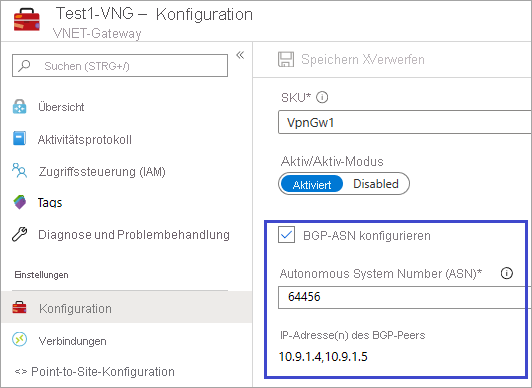
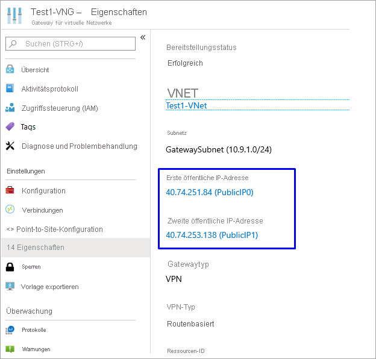
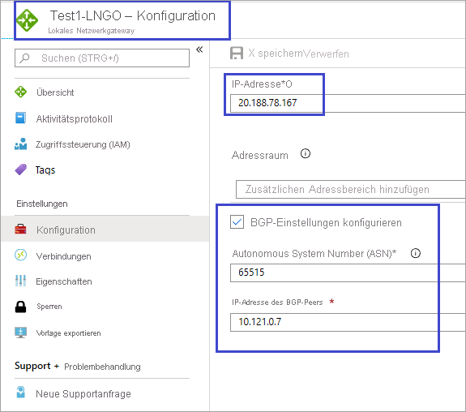
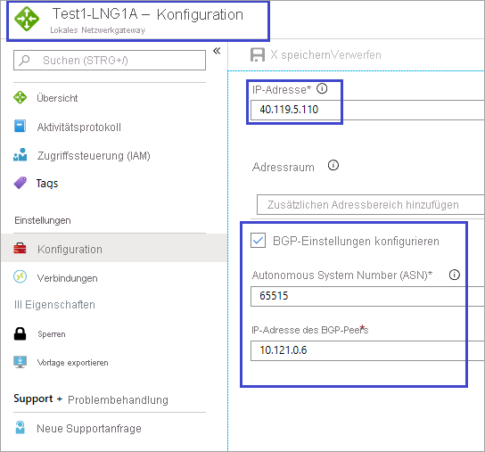

# Herstellen einer Verbindung zwischen einem VPN Gateway (VNet-Gateway) und Virtual WAN

Dieser Artikel unterstützt Sie beim Einrichten einer Verbindung zwischen einem Azure VPN Gateway (VNet-Gateway) und einem Azure Virtual WAN (VPN-Gateway). Das Erstellen einer Verbindung von einem VPN-Gateway (VNet-Gateway) zu einem Virtual WAN (VPN Gateway) weist Ähnlichkeit mit dem Einrichten einer Verbindung zu einem Virtual WAN ausgehend von VPN-Zweigstellen auf.

Um mögliche Verwechslungen zwischen zwei Funktionen zu minimieren, wird dem Gateway der Name der Funktion vorangestellt, auf die verwiesen wird. Beispiel: VPN Gateway VNet-Gateway und Virtual WAN VPN-Gateway.

## Voraussetzungen

Erstellen Sie die folgenden Ressourcen, bevor Sie beginnen:

Azure Virtual WAN

* [Erstellen Sie ein Virtual WAN](virtual-wan-site-to-site-portal.md#openvwan).
* [Erstellen Sie einen Hub](virtual-wan-site-to-site-portal.md#hub). Der virtuelle Hub enthält das Virtual WAN VPN-Gateway.

Virtuelles Azure-Netzwerk

* Erstellen Sie ein virtuelles Netzwerk ohne VNet-Gateways. Stellen Sie sicher, dass sich kein Subnetz Ihres lokalen Netzwerks mit den virtuellen Netzwerken für die Verbindungsherstellung überschneidet. Informationen zum Erstellen eines virtuellen Netzwerks im Azure-Portal finden Sie in der [Schnellstartanleitung](../virtual-network/quick-create-portal.md).

## 1. Erstellen eines virtuellen Netzwerk-Gateways für VPN Gateways

Erstellen Sie ein virtuellen Netzwerk-Gateway für **VPN Gateways** im Aktiv/Aktiv-Modus für das virtuelle Netzwerk. Beim Erstellen des Gateways können Sie entweder vorhandene öffentliche IP-Adressen für die beiden Instanzen des Gateways verwenden oder neue öffentliche IP-Adressen erstellen. Diese öffentlichen IP-Adressen werden beim Einrichten der Virtual WAN-Standorte verwendet. Weitere Informationen zu Aktiv/Aktiv-VPN-Gateways und Konfigurationsschritten finden Sie unter [Konfigurieren von Aktiv/Aktiv-VPN-Gateways](../vpn-gateway/vpn-gateway-activeactive-rm-powershell.md#aagateway).

### Aktiv/Aktiv-Moduseinstellung

Aktivieren Sie auf der Seite **Konfiguration** des Gateways für virtuelle Netzwerke den Aktiv/Aktiv-Modus.

### BGP-Einstellung

Auf der Seite **Konfiguration** des Gateways für virtuelle Netzwerke können Sie die **BGP-ASN** konfigurieren. Ändern Sie die BGP-ASN. Die BGP-ASN kann nicht 65515 sein. 66515 wird vom Azure Virtual WAN verwendet.

### Öffentliche IP-Adressen

Wenn das Gateway erstellt wurde, navigieren Sie zur Seite **Eigenschaften**. Die Eigenschaften und Konfigurationseinstellungen sehen ähnlich aus wie im folgenden Beispiel. Beachten Sie die beiden öffentlichen IP-Adressen, die für das Gateway verwendet werden.

## 2. Erstellen von Virtual WAN VPN-Standorten

Um Virtual WAN VPN-Standorte zu erstellen, navigieren Sie zum virtuellen WAN und wählen Sie unter **Konnektivität** die Option **VPN-Standorte** aus. In diesem Abschnitt erstellen Sie zwei Virtual WAN VPN-Standorte, die den im vorherigen Abschnitt erstellten VNet-Gateways entsprechen.

1. Wählen Sie **+ Standort erstellen**.
2. Geben Sie auf der Seite **VPN-Standorte erstellen** die folgenden Werte ein:

   * **Region**: Geben Sie dieselbe Region wie für das Gateway für virtuelle Netzwerke von Azure VPN Gateway ein.
   * **Gerätehersteller**: Geben Sie den Gerätehersteller (beliebiger Name) ein.
   * **Privater Adressraum**: Geben Sie einen Wert ein, oder lassen Sie das Feld leer, wenn BGP aktiviert ist.
   * **Border Gateway Protocol**: Wählen Sie **Aktivieren** aus, wenn für das Gateway für virtuelle Netzwerke von Azure VPN Gateway BGP aktiviert ist.
   * **Mit Hubs verbinden**:Wählen Sie in der Dropdownliste den Hub aus, den Sie in den Voraussetzungen erstellt haben. Wird kein Hub angezeigt, vergewissern Sie sich, dass Sie ein Site-to-Site-VPN-Gateway für Ihren Hub erstellt haben.
3. Geben Sie unter **Links** die folgenden Werte ein:

   * **Anbietername**: Geben Sie einen Linknamen und einen Anbieternamen (beliebiger Name) ein.
   * **Geschwindigkeit**: Geben Sie die Geschwindigkeit ein (beliebige Zahl).
   * **IP-Adresse**: Geben Sie die IP-Adresse ein (identisch mit der ersten öffentlichen IP-Adresse, die in den Eigenschaften des Gateways für virtuelle Netzwerke (von VPN Gateway) angezeigt wird).
   * **BGP-Adresse** und **ASN**: Geben Sie BGP-Adresse und ASN ein. Diese müssen mit einer der BGP-Peer-IP-Adressen und ASN des VPN Gateway VNet-Gateway übereinstimmen, das Sie in [Schritt 1](#vnetgw) konfiguriert haben.
4. Klicken Sie auf **Bestätigen**, um den Standort zu erstellen.
5. Wiederholen Sie die vorherigen Schritte, um den zweiten Standort entsprechend der zweiten Instanz des VPN Gateway VNet-Gateways zu erstellen. Sie übernehmen die gleichen Einstellungen, verwenden allerdings die zweite öffentliche IP-Adresse und die zweite BGP-Peer-IP-Adresse der VPN Gateway-Konfiguration.
6. Sie haben nun erfolgreich zwei Standorte bereitgestellt und können mit dem nächsten Abschnitt fortfahren, um die Konfigurationsdateien herunterzuladen.

## 3. Herunterladen der VPN-Konfigurationsdateien

In diesem Abschnitt laden Sie die VPN-Konfigurationsdatei für die beiden Standorte herunter, die Sie im vorherigen Abschnitt erstellt haben.

1. Wählen Sie im oberen Bereich der Virtual WAN-Seite **VPN-Standorte** den **Standort** und dann **Site-to-Site-VPN-Konfiguration herunterladen** aus. Azure erstellt eine Konfigurationsdatei mit den entsprechenden Einstellungen.

   
2. Laden Sie die Konfigurationsdatei herunter und öffnen Sie die Datei.
3. Wiederholen Sie diese Schritte für den zweiten Standort. Sobald beide Konfigurationsdateien geöffnet sind, können Sie mit dem nächsten Abschnitt fortfahren.

## 4. Erstellen der lokalen Netzwerkgateways

In diesem Abschnitt erstellen Sie zwei lokale Azure VPN Gateway Netzwerkgateways. Die Konfigurationsdateien aus dem vorherigen Schritt enthalten die Gatewaykonfigurationseinstellungen. Verwenden Sie diese Einstellungen, um die lokalen Azure VPN Gateway Netzwerkgateways zu erstellen und zu konfigurieren.

1. Erstellen Sie das Netzwerkgateway mit diesen Einstellungen. Informationen zum Erstellen eines lokalen VPN Gateway Netzwerkgateways finden Sie im VPN Gateway-Artikel [Erstellen eines lokalen Netzwerkgateways](../vpn-gateway/vpn-gateway-howto-site-to-site-resource-manager-portal.md#LocalNetworkGateway).

   * **IP-Adresse**: Verwenden Sie die IP-Adresse von Instance0 für *gatewayconfiguration* aus der Konfigurationsdatei.
   * **BGP**: Wenn die Verbindung über BGP erfolgt, wählen Sie **BGP-Einstellungen konfigurieren** aus und geben Sie die ASN „65515“ ein. Geben Sie die BGP-Peer-IP-Adresse ein. Verwenden Sie „Instance0 BgpPeeringAddresses“ für *gatewayconfiguration* aus der Konfigurationsdatei.
   * **Abonnement, Ressourcengruppe und Standort** stimmen mit den Werten für den Virtual WAN-Hub überein.
2. Überprüfen und erstellen Sie das lokalen Netzwerkgateway. Das lokale Netzwerkgateway sollte ungefähr wie in diesem Beispiel aussehen.

   
3. Wiederholen Sie diese Schritte, um ein weiteres lokales Netzwerkgateway zu erstellen. Verwenden Sie jedoch dieses Mal die Werte für Instance1 anstelle der Werte für Instance0 aus der Konfigurationsdatei.

   

## 5. Erstellen von Verbindungen

In diesem Abschnitt erstellen Sie eine Verbindung zwischen den lokalen VPN Gateway Netzwerkgateways und dem VNet-Gateway. Weitere Informationen zu den Schritten zum Erstellen einer VPN Gateway-Verbindung finden Sie unter [Konfigurieren einer Verbindung](../vpn-gateway/vpn-gateway-howto-site-to-site-resource-manager-portal.md#CreateConnection).

1. Navigieren Sie im Portal zum VNet-Gateway und klicken Sie auf **Verbindungen**. Klicken Sie oben auf der Seite „Verbindungen“ auf **+Hinzufügen**, um die Seite **Verbindung hinzufügen** zu öffnen.
2. Konfigurieren Sie auf der Seite **Verbindung hinzufügen** die folgenden Werte für Ihre Verbindung:

   * **Name:** Benennen Sie Ihre Verbindung.
   * **Verbindungstyp:** Wählen Sie **Standort-zu-Standort (IPsec)** aus.
   * **Gateway für virtuelle Netzwerke:** Der Wert ist festgelegt, da Sie von diesem Gateway aus die Verbindung herstellen.
   * **Lokales Netzwerkgateway:** Diese Verbindung verbindet das VNet-Gateway mit dem lokalen Netzwerkgateway. Wählen Sie eines der lokalen Netzwerkgateways aus, das Sie zuvor erstellt haben.
   * **Gemeinsam verwendeter Schlüssel:** Geben Sie einen gemeinsam verwendeten Schlüssel ein.
   * **IKE-Protokoll:** Wählen Sie das IKE-Protokoll aus.
3. Klicken Sie auf **OK** , um die Verbindung zu erstellen.
4. Die Verbindung wird auf der Seite **Verbindungen** des Gateways für virtuelle Netzwerke angezeigt.

   
5. Wiederholen Sie anschließend die oben aufgeführten Schritte, um eine weitere Verbindung zu erstellen. Wählen Sie für die zweite Verbindung das andere lokale Netzwerkgateway aus, das Sie erstellt haben.
6. Wenn die Verbindungen über BGP hergestellt wurden, navigieren Sie nach dem Erstellen der Verbindungen zu einer Verbindung, und wählen Sie **Konfiguration** aus. Wählen Sie auf der Seite **Konfiguration** für **BGP** die Option **Aktiviert** aus. Klicken Sie dann auf **Speichern**. Wiederholen Sie dies für die zweite Verbindung.

## 6. Testen von Verbindungen

Sie können die Konnektivität testen, indem Sie zwei virtuelle Computer erstellen, einen auf der Seite des VPN Gateway VNet-Gateways und einen in einem virtuellen Netzwerk für das Virtual WAN. Anschließend können Sie die beiden virtuellen Computer pingen.

1. Erstellen Sie einen virtuellen Computer im virtuellen Netzwerk (Test1-VNet) für das Azure VPN Gateway (Test1-VNG). Erstellen Sie den virtuellen Computer nicht im GatewaySubnet.
2. Erstellen Sie ein weiteres virtuelles Netzwerk, das mit dem Virtual WAN verbunden werden soll. Erstellen Sie einen virtuellen Computer in einem Subnetz dieses virtuellen Netzwerks. Dieses virtuelle Netzwerk darf keine virtuellen Netzwerkgateways enthalten. Sie können mit den PowerShell-Schritten im Artikel [Site-to-Site-Verbindung](virtual-wan-site-to-site-portal.md#vnet) schnell ein virtuelles Netzwerk erstellen. Achten Sie darauf, die Werte zu ändern, bevor Sie das Cmdlet ausführen.
3. Verbinden Sie das VNet mit dem Virtual WAN-Hub. Klicken Sie auf der Seite für das Virtual WAN auf **Virtuelle Netzwerkverbindungen** und dann auf **+ Verbindung hinzufügen**. Füllen Sie auf der Seite **Add connection** (Verbindung hinzufügen) die folgenden Felder aus:

    * **Verbindungsname**: Dies ist der Name Ihrer Verbindung.
    * **Hubs**: Wählen Sie den Hub aus, den Sie dieser Verbindung zuordnen möchten.
    * **Abonnement**: Überprüfen Sie das Abonnement.
    * **Virtuelles Netzwerk**: Wählen Sie das virtuelle Netzwerk aus, das Sie mit diesem Hub verbinden möchten. Für das virtuelle Netzwerk kann nicht bereits ein Gateway für virtuelle Netzwerke vorhanden sein.
4. Klicken Sie auf **OK**, um die VNet-Verbindung zu erstellen.
5. Zwischen den VMs besteht jetzt eine Verbindung. Sie sollten in der Lage sein, eine VM ausgehend von der anderen zu pingen, sofern es keine Firewalls oder andere Richtlinien gibt, die die Kommunikation blockieren.

## Nächste Schritte

Schritte zum Konfigurieren einer benutzerdefinierten IPsec-Richtlinie finden Sie unter [Konfigurieren einer benutzerdefinierten IPsec-Richtlinie für ein Virtual WAN](virtual-wan-custom-ipsec-portal.md).
Weitere Informationen zu Virtual WAN, finden Sie unter [Über Virtual WAN](virtual-wan-about.md) und [FAQS zu Azure Virtual WAN](virtual-wan-faq.md).
