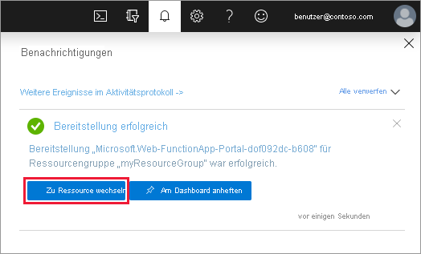

1. Wählen Sie im Menü des Azure-Portals oder auf der **Startseite** die Option **Ressource erstellen** aus.

1. Wählen Sie auf der Seite **Neu** die Option **Compute** > **Funktions-App** aus.

1. Verwenden Sie auf der Seite **Grundlagen** die Funktions-App-Einstellungen, die in der folgenden Tabelle angegeben sind.

    | Einstellung      | Vorgeschlagener Wert  | BESCHREIBUNG |
    | ------------ | ---------------- | ----------- |
    | **Abonnement** | Ihr Abonnement | Das Abonnement, unter dem diese neue Funktions-App erstellt wird. |
    | **[Ressourcengruppe](../articles/azure-resource-manager/management/overview.md)** |  *myResourceGroup* | Der Name der neuen Ressourcengruppe, in der die Funktionen-App erstellt wird |
    | **Name der Funktions-App** | Global eindeutiger Name | Der Name, der Ihre neue Funktionen-App bezeichnet Gültige Zeichen sind `a-z` (Groß-/Kleinschreibung nicht beachtet), `0-9` und `-`.  |
    |**Veröffentlichen**| Code | Option zum Veröffentlichen von Codedateien oder eines Docker-Containers. |
    | **Laufzeitstapel** | Bevorzugte Sprache | Wählen Sie eine Runtime aus, die Ihre bevorzugte Programmiersprache für Funktionen unterstützt. Die Bearbeitung im Portal ist nur für JavaScript-, PowerShell-, TypeScript- und C#-Skripts verfügbar. C#-Klassenbibliotheks-, Java- und Python-Funktionen müssen [lokal entwickelt](../articles/azure-functions/functions-develop-local.md#local-development-environments) werden.  |
    |**Version**| Versionsnummer | Wählen Sie die Version der installierten Runtime aus. |
    |**Region**| Bevorzugte Region | Wählen Sie eine [Region](https://azure.microsoft.com/regions/) in Ihrer Nähe oder in der Nähe von anderen Diensten aus, auf die Ihre Funktionen zugreifen. |

1. Wählen Sie **Weiter: Hosting** aus. Geben Sie auf der Seite **Hosting** die folgenden Einstellungen ein.

    | Einstellung      | Vorgeschlagener Wert  | BESCHREIBUNG |
    | ------------ | ---------------- | ----------- |
    | **[Speicherkonto](../articles/storage/common/storage-account-create.md)** |  Global eindeutiger Name |  Erstellen Sie ein Speicherkonto, das von Ihrer Funktions-App verwendet wird. Speicherkontonamen müssen zwischen 3 und 24 Zeichen lang sein und dürfen nur Zahlen und Kleinbuchstaben enthalten. Sie können auch ein vorhandenes Konto verwenden, das die [Anforderungen an das Speicherkonto](../articles/azure-functions/storage-considerations.md#storage-account-requirements) erfüllen muss. |
    |**Betriebssystem**| Windows | Ein Betriebssystem ist für Sie basierend auf Ihrer Runtimestapelauswahl vorab ausgewählt, aber Sie können die Einstellung ggf. ändern. Die portalinterne Bearbeitung wird nur unter Windows unterstützt. |
    | **[Plan](../articles/azure-functions/functions-scale.md)** | **Verbrauch (serverlos)** | Der Hostingplan, der definiert, wie Ihre Ressourcen der Funktionen-App zugewiesen werden Im Standard-**Verbrauchstarif** werden Ressourcen so dynamisch hinzugefügt, wie dies für Ihre Funktionen erforderlich ist. Beim [serverlosen Hosting](https://azure.microsoft.com/overview/serverless-computing/) bezahlen Sie nur die Zeit, in der Ihre Funktionen ausgeführt werden. Bei der Ausführung in einem App Service-Plan müssen Sie die [Skalierung Ihrer Funktions-App](../articles/azure-functions/functions-scale.md) verwalten.  |

1. Wählen Sie **Weiter: Überwachung** aus. Geben Sie auf der Seite **Überwachung** die folgenden Einstellungen ein.

    | Einstellung      | Vorgeschlagener Wert  | BESCHREIBUNG |
    | ------------ | ---------------- | ----------- |
    | **[Application Insights](../articles/azure-functions/functions-monitoring.md)** | Standard | Erstellt eine Application Insights-Ressource mit dem gleichen *App-Namen* in der nächstgelegenen unterstützten Region. Durch Erweitern dieser Einstellung oder Auswählen von **Neu erstellen** können Sie den Application Insights-Namen ändern oder eine andere Region in einer [Azure-Geografie](https://azure.microsoft.com/global-infrastructure/geographies/) auswählen, in der Sie Ihre Daten speichern möchten. |

1. Wählen Sie **Bewerten + erstellen** aus, um die App-Konfigurationsauswahl zu überprüfen.

1. Überprüfen Sie auf der Seite **Bewerten + erstellen** Ihre Einstellungen, und wählen Sie dann **Erstellen** aus, um die Funktions-App bereitzustellen.

1. Wählen Sie oben rechts im Portal das **Benachrichtigungssymbol** aus, und achten Sie auf die Meldung **Bereitstellung erfolgreich**.

1. Wählen Sie **Zu Ressource wechseln**, um Ihre neue Funktionen-App anzuzeigen. Sie können auch die Option **An Dashboard anheften** auswählen. Wenn Sie die Funktions-App anheften, können Sie einfacher über das Dashboard auf sie zugreifen.

    
