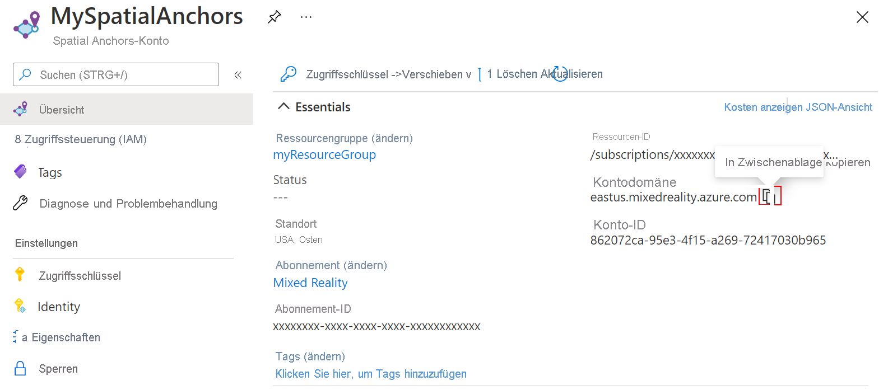

## <a name="create-a-spatial-anchors-resource"></a>Erstellen einer Spatial Anchors-Ressource

### <a name="portal"></a>[Portal](#tab/azure-portal)

Öffnen Sie das <a href="https://portal.azure.com" target="_blank">Azure-Portal</a>.

Wählen Sie im linken Bereich **Ressource erstellen** aus.

Suchen Sie über das Suchfeld nach **Spatial Anchors**.


Wählen Sie **Spatial Anchors** und dann **Erstellen** aus.

Führen Sie im Bereich **Spatial Anchors-Konto** die folgenden Schritte aus:

* Geben Sie einen eindeutigen Ressourcennamen in regulären alphanumerischen Zeichen ein.
* Wählen Sie das Abonnement aus, an das die Ressource angefügt werden soll.
* Erstellen Sie eine Ressourcengruppe durch Auswählen von **Neu erstellen**. Nennen Sie sie **myResourceGroup**, und wählen Sie **OK** aus.

  [!INCLUDE [resource group intro text](resource-group.md)]

* Wählen Sie einen Standort (Region) für die Ressource aus.
* Wählen Sie **Neu** aus, um mit der Ressourcenerstellung zu beginnen.


Nachdem die Ressource erstellt wurde, zeigt das Azure-Portal an, dass die Bereitstellung abgeschlossen ist.


Wählen Sie **Zu Ressource wechseln** aus. Nun können Sie die Ressourceneigenschaften anzeigen.

Kopieren Sie den Wert für **Konto-ID** der Ressource zur späteren Verwendung in einen Text-Editor.


Kopieren Sie außerdem den Wert für **Kontodomäne** der Ressource zur späteren Verwendung in einen Text-Editor.



Wählen Sie unter **Einstellungen** die Option **Schlüssel** aus. Kopieren Sie die Werte für **Primärschlüssel** und **Kontoschlüssel** zur späteren Verwendung in einen Text-Editor.


### <a name="azure-cli"></a>[Azure-Befehlszeilenschnittstelle](#tab/azure-cli)

Bereiten Sie zunächst Ihre Umgebung für die Azure-Befehlszeilenschnittstelle vor:

[!INCLUDE [azure-cli-prepare-your-environment-no-header.md](azure-cli-prepare-your-environment-no-header.md)]

1. Nachdem Sie sich angemeldet haben, verwenden Sie den Befehl [az account set](/cli/azure/account#az_account_set), um das Abonnement auszuwählen, in dem das Spatial Anchors-Konto eingerichtet werden soll:

   ```azurecli
   az account set --subscription 00000000-0000-0000-0000-000000000000
   ```

1. Führen Sie den Befehl [az group create](/cli/azure/group#az_group_create) aus, um eine Ressourcengruppe zu erstellen, oder verwenden Sie eine vorhandene Ressourcengruppe:

   ```azurecli
   az group create --name myResourceGroup --location eastus2
   ```

   [!INCLUDE [resource group intro text](resource-group.md)]

   Sie können Ihre aktuellen Spatial Anchors-Konten für eine Ressourcengruppe mit dem Befehl [az spatial-anchors-account list](/cli/azure/ext/mixed-reality/spatial-anchors-account#ext_mixed_reality_az_spatial_anchors_account_list) anzeigen:

   ```azurecli
   az spatial-anchors-account list --resource-group myResourceGroup
   ```

   Sie können auch die Spatial Anchors-Konten für Ihr Abonnement anzeigen:

   ```azurecli
   az spatial-anchors-account list
   ```

1. Führen Sie den Befehl [az spatial-anchors-account create](/cli/azure/ext/mixed-reality/spatial-anchors-account#ext_mixed_reality_az_spatial_anchors_account_create) aus, um Ihr Spatial Anchors-Konto zu erstellen:

   ```azurecli
   az spatial-anchors-account create --resource-group myResourceGroup --name MySpatialAnchorsQuickStart --location eastus2
   ```

1. Zeigen Sie die Ressourceneigenschaften mit dem Befehl [az spatial-anchors-account show](/cli/azure/ext/mixed-reality/spatial-anchors-account#ext_mixed_reality_az_spatial_anchors_account_show) an:

   ```azurecli
   az spatial-anchors-account show --resource-group myResourceGroup --name MySpatialAnchorsQuickStart
   ```

   Kopieren Sie die Werte von **Konto-ID** und **Kontodomäne** der Ressource zur späteren Verwendung in einen Text-Editor.

1. Führen Sie den Befehl [az spatial-anchors-account key show](/cli/azure/ext/mixed-reality/spatial-anchors-account/key#ext_mixed_reality_az_spatial_anchors_account_key_show) aus, um Ihre primären und sekundären Schlüssel zu erhalten:

   ```azurecli
   az spatial-anchors-account key show --resource-group myResourceGroup --name MySpatialAnchorsQuickStart
   ```

   Kopieren Sie die Schlüsselwerte zur späteren Verwendung in einen Text-Editor.

   Wenn Sie Schlüssel erneut generieren müssen, verwenden Sie den Befehl [az spatial-anchors-account key renew](/cli/azure/ext/mixed-reality/spatial-anchors-account/key#ext_mixed_reality_az_spatial_anchors_account_key_renew):

   ```azurecli
   az spatial-anchors-account key renew --resource-group myResourceGroup --name example --key primary
   az spatial-anchors-account key renew --resource-group myResourceGroup --name example --key secondary
   ```

Führen Sie zum Löschen eines Kontos den Befehl [az spatial-anchors-account delete](/cli/azure/ext/mixed-reality/spatial-anchors-account#ext_mixed_reality_az_spatial_anchors_account_delete) aus:

```azurecli
az spatial-anchors-account delete --resource-group myResourceGroup --name MySpatialAnchorsQuickStart
```

### <a name="azure-powershell"></a>[Azure PowerShell](#tab/azure-powershell)

Bereiten Sie zunächst Ihre Umgebung für Azure PowerShell vor:

[!INCLUDE [azure-powershell-requirements-no-header.md](azure-powershell-requirements-no-header.md)]

> [!IMPORTANT]
> Solange nur eine Vorschauversion des PowerShell-Moduls **Az.MixedReality** verfügbar ist, müssen Sie es separat mit dem Cmdlet `Install-Module` installieren. Sobald dieses PowerShell-Modul allgemein verfügbar ist, wird es in die zukünftigen Releases des Az PowerShell-Moduls integriert und in Azure Cloud Shell standardmäßig zur Verfügung gestellt.

```azurepowershell-interactive
Install-Module -Name Az.MixedReality
```

1. Nachdem Sie sich angemeldet haben, verwenden Sie den Befehl [Set-AzContext](/powershell/module/az.accounts/set-azcontext), um das Abonnement auszuwählen, in dem das Spatial Anchors-Konto eingerichtet werden soll:

   ```azurepowershell-interactive
   Set-AzContext -SubscriptionId 00000000-0000-0000-0000-000000000000
   ```

1. Führen Sie das Cmdlet [New-AzResourceGroup](/powershell/module/az.resources/new-azresourcegroup) aus, um eine Ressourcengruppe zu erstellen, oder verwenden Sie eine vorhandene Ressourcengruppe:

   ```azurepowershell-interactive
   New-AzResourceGroup -Name myResourceGroup -Location eastus2
   ```

   [!INCLUDE [resource group intro text](resource-group.md)]

   Sie können Ihre aktuellen Spatial Anchors-Konten für eine Ressourcengruppe anzeigen, indem Sie das Cmdlet [Get-AzSpatialAnchorsAccount](/powershell/module/az.mixedreality/get-azspatialanchorsaccount) verwenden:

   ```azurepowershell-interactive
   Get-AzSpatialAnchorsAccount -ResourceGroup myResourceGroup
   ```

   Sie können auch die Spatial Anchors-Konten für Ihr Abonnement anzeigen:

   ```azurepowershell-interactive
   Get-AzSpatialAnchorsAccount
   ```

1. Führen Sie das Cmdlet [New-AzSpatialAnchorsAccount](/powershell/module/az.mixedreality/new-azspatialanchorsaccount) aus, um Ihr Spatial Anchors-Konto zu erstellen:

   ```azurepowershell-interactive
   New-AzSpatialAnchorsAccount -ResourceGroup myResourceGroup -Name MySpatialAnchorsQuickStart -Location eastus2
   ```

1. Zeigen Sie die Ressourceneigenschaften mit dem Cmdlet [Get-AzSpatialAnchorsAccount](/powershell/module/az.mixedreality/get-azspatialanchorsaccount) an:

   ```azurepowershell-interactive
   Get-AzSpatialAnchorsAccount -ResourceGroup myResourceGroup -Name MySpatialAnchorsQuickStart
   ```

   Kopieren Sie die Eigenschaftswerte **accountId** und **accountDomain** zur späteren Verwendung in einen Text-Editor.

1. Führen Sie das Cmdlet [Get-AzSpatialAnchorsAccountKey](/powershell/module/az.mixedreality/get-azspatialanchorsaccountkey) aus, um Ihre primären und sekundären Schlüssel abzurufen:

   ```azurepowershell-interactive
   Get-AzSpatialAnchorsAccountKey -ResourceGroup myResourceGroup -Name MySpatialAnchorsQuickStart
   ```

   Kopieren Sie die Schlüsselwerte zur späteren Verwendung in einen Text-Editor.

   Verwenden Sie das Cmdlet [New-AzSpatialAnchorsAccountKey](/powershell/module/az.mixedreality/new-azspatialanchorsaccountkey), falls Sie Schlüssel erneut generieren müssen:

   ```azurepowershell-interactive
   New-AzSpatialAnchorsAccountKey -ResourceGroupName myResourceGroup -Name MySpatialAnchorsQuickStart -Primary
   New-AzSpatialAnchorsAccountKey -ResourceGroupName myResourceGroup -Name MySpatialAnchorsQuickStart -Secondary
   ```

Mit dem Cmdlet [Remove-AzSpatialAnchorsAccount](/powershell/module/az.mixedreality/remove-azspatialanchorsaccount) können Sie ein Konto löschen:

```azurepowershell-interactive
Remove-AzSpatialAnchorsAccount -ResourceGroup myResourceGroup -Name MySpatialAnchorsQuickStart
```

---
